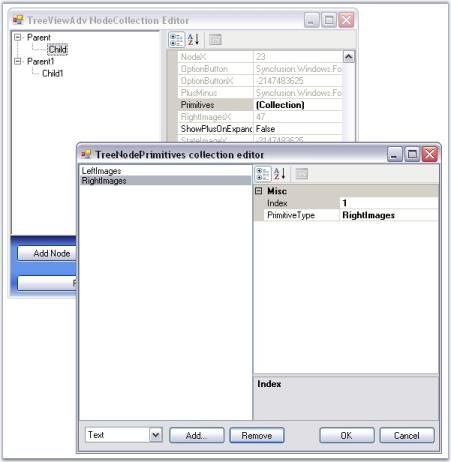
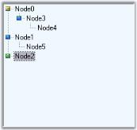
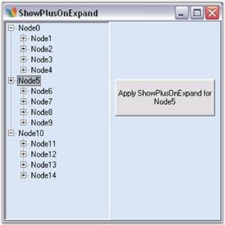
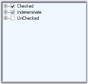
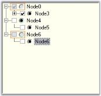
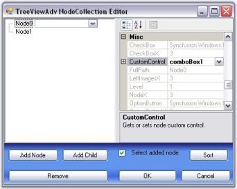

# TreeNode Features in WinForms TreeView (SfTreeView)

This section discusses the following topics.

## Primitives

[WinForms TreeViewAdv](https://www.syncfusion.com/winforms-ui-controls/treeview) control supports a set of primitive collections, that can be set through the Primitives Collection Editor available with each node in the TreeViewAdv controls. 

The types of primitives available are LabelPrimitive, LeftImagePrimitive, RightImagePrimitive, CheckBoxPrimitive, OptionButtonPrimitive and CustomControlPrimitive.

The Primitive Collection Editor available for each node provides index property. Using this index set, for each primitive, the position for each of these node contents can be set.

* LabelPrimitive - LabelPrimitive is used to display the text of the label.
* LeftImagePrimitive - LeftImagePrimitive is used to display the image to the left of the nodes. 
* RightImagePrimitive - RightImagePrimitive is used to display the image that is added to the right of the nodes.
* StateImagePrimitive - StateImagePrimitive is used to display the state image of the node depending on its state, whether expanded or collapsed.
* CheckBoxPrimitive - CheckBoxPrimitive is used to display the checkbox for the nodes. When user clicks on this, the node will be checked.
* OptionButtonPrimitive - OptionButtonPrimitive is used to display the Option button available for the nodes. When the user clicks this primitive, the corresponding node will be selected.
* CustomControlPrimitives - CustomControlPrimitive displays the custom control for the nodes. User can use the functionality of the custom control primitive which is added to the nodes.	



Node Images

Checkbox and Option Buttons

CustomControls



## Node Images

[WinForms TreeViewAdv](https://www.syncfusion.com/winforms-ui-controls/treeview) control can be customized with images for each of its actions for example collapse / expand state, plus / minus of the tree etc., This section discusses about the below topics.

* Left, Right and State Images
* Expand and Collapse Image
* Line Images
* Image Overlaying
* Plus Sign On ExpandMode


Node Images Events


### Left, Right, and State Images

This section discusses about adding Left, Right and State images to the nodes and various image settings for the TreeViewAdv control.

Left/Right Images

The tree nodes can be set with left / right images using LeftImageList and RightImageList properties in the property window. Left / Right images for the individual nodes can be specified in LeftImageIndices and RightImageIndices properties of individual nodes, using the TreeViewAdv Nodes Collection Editor. 

The nodes with the images can be given an enhanced appearance using LeftImagePadding and RightImagePadding.

Property Table

<table>
<tr>
<th>
TreeViewAdv Property</th><th>
Description</th></tr>
<tr>
<td>
LeftImageList</td><td>
Indicates the image list that holds the images to be drawn on the left of the Node. </td></tr>
<tr>
<td>
RightImageList</td><td>
This indicates the image list that holds the images to be drawn on the right of the Node.</td></tr>
</table>

Property Table

<table>
<tr>
<td>
TreeNodeAdv Property</td><td>
Description</td></tr>
<tr>
<td>
LeftImageIndices</td><td>
It is the image index to be drawn on the left of the node's text.</td></tr>
<tr>
<td>
RightImageIndices</td><td>
It is the image index to be drawn on the right of the node's text.</td></tr>
<tr>
<td>
LeftImagePadding</td><td>
It is the space provided between the LeftImage of the node and node.</td></tr>
<tr>
<td>
RightImagePadding</td><td>
It is the space provided between the RightImage of the node and node.</td></tr>
</table>

Setting State Images

Different images can be set for expand / collapse states of the node, using StateImageList property. To apply the left open and close images, set the ClosedImageIndex and the OpenImageIndex to the indices that points to the images in the StateImageList respectively. Nodes without child can be set with a separate image using NoChildrenImageIndex.

Property Table

<table>
<tr>
<th>
TreeViewAdv Property</th><th>
Description</th></tr>
<tr>
<td>
ClosedImageIndex</td><td>
It is the StateImageList index value of the image that is displayed, when a tree node is collapsed.</td></tr>
<tr>
<td>
NoChildrenImageIndex</td><td>
It is the StateImageList index value of the image that is displayed, when a tree node has no children.</td></tr>
<tr>
<td>
NodeStateImageList</td><td>
Indicates the image list with images that are displayed instead of expand / collapse button.</td></tr>
<tr>
<td>
OpenImageIndex</td><td>
It is the StateImageList index value of the image that is displayed, when a tree node is expanded.</td></tr>
<tr>
<td>
StateImageList</td><td>
This indicates the image list that holds the images to be drawn based on the state of the Node.</td></tr>
</table>

N> The above properties can also be set for individual nodes.

<table>
<tr>
<th>
TreeNodeAdv Property</th><th>
Description</th></tr>
<tr>
<td>
ClosedImageIndex</td><td>
It is the image index in StateImageList where the node is collapsed.</td></tr>
<tr>
<td>
NoChildrenImageIndex</td><td>
It is the image index indicating the image in the StateImageList where the node has no children.</td></tr>
<tr>
<td>
OpenImageIndex</td><td>
It is the image index in StateImageList where the node is expanded.</td></tr>
<tr>
<td>
LeftStateImagePadding</td><td>
It is the space provided between, the LeftStateImage of the node and node.</td></tr>
<tr>
<td>
RightStateImagePadding</td><td>
It is the space provided between, the RightStateImage of the node and node.</td></tr>
</table>
Customizing the Image Size

The ImageSize property let you enhance the image size for a TreeNodeAdv. By default, the TreeViewAdv control displays the image size depending on the size of the image that is set in the image list.




this.leftImageList.ImageSize = new System.Drawing.Size(16, 16);
this.rightImageList.ImageSize = new System.Drawing.Size(16, 16);
this.stateImageList.ImageSize = new System.Drawing.Size(16, 16);





Me.leftImageList.ImageSize = New System.Drawing.Size(16, 16)
Me.rightImageList.ImageSize = New System.Drawing.Size(16, 16)
Me.stateImageList.ImageSize = New System.Drawing.Size(15, 15)






Line images

Expand and Collapse Image

Styles Architecture



### Expand and Collapse Image

When child nodes are added to a node, automatically the expand / collapse (+/-) images are set by default, to the parent node, which indicates whether the nodes are opened or closed. These default images can be replaced with custom images using NodeStateImageList property.

* Images to be displayed for the expanded and collapsed nodes can be specified in the DefaultExpandImageIndex and DefaultCollapseImageIndex properties respectively.
* Images for individual nodes can be specified in treeNodeAdv.ExpandImageIndex / treeNodeAdv.CollapseImageIndex properties. Setting these properties will override the expand / collapse image settings that is applied for the control.

Property Table

<table>
<tr>
<th>
TreeViewAdv Property</th><th>
Description</th></tr>
<tr>
<td>
Expanded</td><td>
Indicates if the node is expanded.</td></tr>
<tr>
<td>
DefaultCollapseImageIndex</td><td>
It is the default image index when a tree node is collapsed.</td></tr>
<tr>
<td>
DefaultExpandImageIndex</td><td>
It is the default image index when a tree node is expanded.</td></tr>
<tr>
<td>
NodeStateImageList</td><td>
Indicates the image list with images that are displayed instead of expand / collapse button.</td></tr>
</table>

These properties can be set at the node level using the below properties.

Property Table

<table>
<tr>
<th>
TreeNodeAdv Property</th><th>
Description</th></tr>
<tr>
<td>
CollapseImageIndex</td><td>
It is the image index for collapse button.</td></tr>
<tr>
<td>
ExpandImageIndex</td><td>
It is the image index for expand button.</td></tr>
</table>

N> You can customize the background of the plus minus control. Click here to know more about this.



Line Images



### Line Images

TreeViewAdv control provides options to customize the lines which connects the nodes and also can hold custom images for expand / collapse operations. These properties are discussed in this section.

Line and Plus/Minus images

ShowRootLines when disabled, does not display the connecting lines for root items alone. That is, show lines will be displayed for rest of the items except for the level-1 items which will not be connected to one another with show lines.

ShowLines when disabled, does not display the connecting lines for the entire tree control. The hierarchical lines can be customized by setting the type of lines to be used and the color using the LineStyle and LineColor properties.

The standard +/- signs for the expand/collapse buttons in the TreeViewAdv can be replaced with custom images by setting the ImageList to the NodeStateImageList property of the TreeViewAdv. This is discussed here.

ShowPlusMinus when disabled, does not display the plus / minus images for the parent nodes, i.e., the expand/collapse images will not be displayed.

Property Table

<table>
<tr>
<th>
TreeViewAdv Property</th><th>
Description</th></tr>
<tr>
<td>
LineColor</td><td>
Indicates the color of the tree lines.</td></tr>
<tr>
<td>
LineStyle</td><td>
Indicates the line styles of the tree lines.</td></tr>
<tr>
<td>
ShowLines</td><td>
Indicates if the tree lines are visible.</td></tr>
<tr>
<td>
ShowPlusMinus</td><td>
Indicates if the plus or minus controls are visible for the tree.</td></tr>
<tr>
<td>
ShowRootLines</td><td>
Indicates whether lines are displayed between root nodes.</td></tr>
</table>




this.treeViewAdv1.LineColor = System.Drawing.Color.Black;
this.treeViewAdv1.LineStyle = System.Drawing.Drawing2D.DashStyle.Dash;
this.treeViewAdv1.ShowLines = true;
this.treeViewAdv1.ShowPlusMinus = true;
this.treeViewAdv1.ShowRootLines = true;





Me.treeViewAdv1.LineColor = System.Drawing.Color.Black
Me.treeViewAdv1.LineStyle = System.Drawing.Drawing2D.DashStyle.Dash
Me.treeViewAdv1.ShowLines = True
Me.treeViewAdv1.ShowPlusMinus = True
Me.treeViewAdv1.ShowRootLines = True




N> ShowPlusMinus properties can also be set for individual nodes.

<table>
<tr>
<td>
TreeNodeAdv Property</td><td>
Description</td></tr>
<tr>
<td>
ShowPlusMinus</td><td>
Indicates if the plus or minus of the node is visible.</td></tr>
</table>

### Image Overlaying

The steps below will show how you could draw overlay images on the images associated with the tree nodes.

* Set the TreeViewAdv's OwnerDrawNodes property to true.
* Handle the TreeViewAdv's AfterNodePaint event as shown in code below to perform overlaying of images. The below code snippet shows overlaying LeftImages. The same code snippet can be used for overlaying RightImages and StateImages also by replacing LeftImagesX with RightImagesX and StateImagesX respectively.




private void treeViewAdv1_AfterNodePaint(object sender, Syncfusion.Windows.Forms.Tools.TreeNodeAdvPaintEventArgs e)
{
// Suppose you wish to draw an overlay image on the image associated with the selected node.
    TreeNodeAdv node = this.treeViewAdv1.SelectedNode;

// Get the position of the node's image.
Point point = new Point(node.LeftImagesX, node.TextAndImageBounds.Y);

// Perform image drawing.
e.Graphics.DrawImage(overlayImage, point);
}





Private Sub treeViewAdv1_AfterNodePaint(sender As Object, e As Syncfusion.Windows.Forms.Tools.TreeNodeAdvPaintEventArgs) Handles treeViewAdv1.AfterNodePaint

' Suppose you wish to draw an overlay image on the image associated with the selected node.
Dim node As TreeNodeAdv = Me.treeViewAdv1.SelectedNode

' Get the position of the node's image.
Dim point As New Point(node.LeftImagesX, node.TextAndImageBounds.Y)

' Perform image drawing.
e.Graphics.DrawImage(overlayImage, point)

End Sub 




A sample demonstrating this feature is available in the below sample installation location.

…\_My Documents\Syncfusion\EssentialStudio\Version Number\Windows\Tools.Windows\Samples\Advanced Editor Functions\ActionGroupingDemo_

### Plus Sign On ExpandMode

The nodes in the tree view, even when it is in the expanded state, can still display the PLUS (+) sign using the ShowPlusOnExpand property.

LoadOnDemand property should be set to true for this feature to be effected.

The BeforeExpand event will be raised when the plus is clicked again and when in expanded mode so that you can check the datasource for changes. 

Property Table

<table>
<tr>
<td>
TreeNodeAdv Property</td><td>
Description</td></tr>
<tr>
<td>
ShowPlusOnExpand</td><td>
Indicates if the plus minus of the node is visible.</td></tr>
</table>

This will effect only if the LoadOnDemand property is set to true.




this.treeViewAdv1.LoadOnDemand = true;
private void button1_Click(object sender, System.EventArgs e)
{
     TreeNodeAdv node=this.treeViewAdv1.Nodes[2];

// Setting ShowPlusOnExpand to true for the selected node.
     node.ShowPlusOnExpand=true;
     this.treeViewAdv1.SelectedNode=this.treeViewAdv1.Nodes[2];
}





Me.treeViewAdv1.LoadOnDemand = True
Private Sub button1_Click(ByVal sender As Object, ByVal e As System.EventArgs)
    Dim node As TreeNodeAdv=Me.treeViewAdv1.Nodes(2)

' Setting ShowPlusOnExpand to true for the selected node.
node.ShowPlusOnExpand=True
Me.treeViewAdv1.SelectedNode=Me.treeViewAdv1.Nodes(2)
End Sub




Given below is a screen shot of this.

## Checkbox and Option Buttons

### Adding Checkbox to the Nodes

The ShowCheckBoxes property when set will display check box for all the nodes. To apply checkbox to individual nodes, set the TreeNodeAdv.ShowCheckBox property, only for the required nodes in the NodeCollection Editor.

The InteractiveCheckBoxes indicates whether the state of the parent node's checkbox is based on the check state of it's child nodes checkboxes. To set this for individual nodes set the InteractiveCheckBox property of the TreeNodeAdv.

Property Table

<table>
<tr>
<th>
TreeViewAdv Property</th><th>
Description</th></tr>
<tr>
<td>
ShowCheckBoxes</td><td>
Indicates if the checkbox will be shown for the nodes.</td></tr>
<tr>
<td>
InteractiveCheckBoxes</td><td>
Indicates if the state of the node's checkbox indicates the check state of the child node's checkboxes.</td></tr>
</table>

Property Table

<table>
<tr>
<th>
TreeNodeAdv Property</th><th>
Description</th></tr>
<tr>
<td>
ShowCheckBox</td><td>
Indicates if the checkbox of the node is visible.</td></tr>
<tr>
<td>
InteractiveCheckBox</td><td>
Indicates if the node will have an interactive checkbox.</td></tr>
</table>

N> On Changing the check state of the checkbox, AfterInteractiveChecks event will be triggered.

Tristate CheckBox Settings

In the TreeViewAdv, the partial checking of the child nodes are supported. They are Checked State, Unchecked State and Intermediate State.

The CheckColor and CheckState property is used to set the color and the state of the check mark of the particular selected node. The options for the CheckState property are Checked, Unchecked and Indeterminate.

Property Table

<table>
<tr>
<th>
TreeNodeAdv Property</th><th>
Description</th></tr>
<tr>
<td>
CheckColor</td><td>
Indicates the color of the check mark.</td></tr>
<tr>
<td>
CheckState</td><td>
Indicates the check state of the node.</td></tr>
<tr>
<td>
IntermediateCheckColor</td><td>
Indicates the color of the check mark when it is in intermediate state or when its CheckState property is set to indeterminate.</td></tr>
<tr>
<td>
Checked</td><td>
This indicates if the node's checkbox is checked.</td></tr>
<tr>
<td>
EnsureDefaultOptionedChild</td><td>
This specifies if at least one child of the parent node should be selected at all times.</td></tr>
</table>




treeNodeAdv8.CheckColor = System.Drawing.SystemColors.ControlDarkDark;
treeNodeAdv7.CheckState = System.Windows.Forms.CheckState.Indeterminate;
treeNodeAdv8.EnsureDefaultOptionedChild =  true;
treeNodeAdv8.Checked = true;





TreeNodeAdv8.CheckColor = System.Drawing.SystemColors.ControlDarkDark
TreeNodeAdv7.CheckState = System.Windows.Forms.CheckState.Indeterminate
TreeNodeAdv8.EnsureDefaultOptionedChild = True
TreeNodeAdv8.Checked = True




### Adding Option Buttons

ShowOptionButtons property, when set, will add option buttons to all the nodes which can be applied for the required nodes alone, by setting the property for the respective nodes in the NodeCollection Editor.

Property Table

<table>
<tr>
<td>
TreeNodeAdv Property</td><td>
Description</td></tr>
<tr>
<td>
SelectedOptionButtonColor</td><td>
Indicates the color of the option button in the selected state.</td></tr>
<tr>
<td>
ShowOptionButton</td><td>
Indicates if the option button of the node is visible.</td></tr>
<tr>
<td>
OptionButtonColor</td><td>
This indicates the color of the option button.</td></tr>
<tr>
<td>
Optioned</td><td>
This indicates if the node's option button is checked.</td></tr>
</table>




treeNodeAdv9.SelectedOptionButtonColor = System.Drawing.Color.Red;
treeNodeAdv3.OptionButtonColor = System.Drawing.Color.AliceBlue;
treeNodeAdv6.OptionButtonColor = System.Drawing.Color.PowderBlue;
treeNodeAdv8.OptionButtonColor = System.Drawing.Color.MediumAquamarine;





TreeNodeAdv9.SelectedOptionButtonColor = System.Drawing.Color.Red
treeNodeAdv3.OptionButtonColor = System.Drawing.Color.AliceBlue
treeNodeAdv6.OptionButtonColor = System.Drawing.Color.PowderBlue
treeNodeAdv8.OptionButtonColor = System.Drawing.Color.MediumAquamarine




Disabling a node's Checkbox or Option button

The user can disable the checkbox or the option button of a node and can still select and deselect the node by setting the EnabledButtons property to false of the respective TreeNodeAdv.

Property Table

<table>
<tr>
<th>
TreeNodeAdv Property</th><th>
Description</th></tr>
<tr>
<td>
EnabledButtons</td><td>
Indicates if the buttons that are displayed, are enabled for the particular node.</td></tr>
</table>

## Custom Controls

Tree Nodes can hold controls using this Custom Controls feature. This widens the functionality and view of the Tree nodes. With this feature, the nodes can hold controls like combo box, Calendar, Chart etc.,

Any custom control can be dragged and dropped to the form and selected using TreeNodeAdv.CustomControls property

We can also add functionality based on the changes made to the CustomControls.

A sample which demonstrates Custom Controls feature is available in the below sample installation location. This sample illustrates adding functionality based on the changes to the custom controls.

…\_My Documents\Syncfusion\EssentialStudio\Version Number\Windows\Tools.Windows\Samples\Advanced Editor Functions\ActionGroupingDemo_

## Enabling the Control

The TreeView control can be enabled using the below properties.

Property Table

<table>
<tr>
<th>
TreeViewAdv Property</th><th>
Description</th></tr>
<tr>
<td>
Enabled</td><td>
Indicates whether the control is enabled and can respond to user interactions.</td></tr>
</table>

Property Table

<table>
<tr>
<th>
TreeNodeAdv Property</th><th>
Description</th></tr>
<tr>
<td>
Enabled</td><td>
Indicates whether a particular node is enabled.</td></tr>
</table>