# TreeNodeAdv Customization in Windows Forms TreeView

## OptionButton

The Option Buttons can be displayed for the nodes in the `TreeViewAdv` using the `ShowOptionButtons` property. We can also show or hide the Option Button for a respective node using `ShowOptionButton` property in the `TreeNodeAdv`.

<b>Property Table</b>

<table>
<tr>
<th>
TreeNodeAdv Property</th><th>
Description</th></tr>
<tr>
<td>
SelectedOptionButtonColor</td><td>
Indicates the color of the option button in the selected state.</td></tr>
<tr>
<td>
ShowOptionButton</td><td>
Indicates if the option button of the node is visible.</td></tr>
<tr>
<td>
OptionButtonColor</td><td>
Indicates the color of the option button.</td></tr>
<tr>
<td>
Optioned</td><td>
Indicates if the node's option button is checked.</td></tr>
</table>



treeNode.ShowOptionButton = true;
treeNode.SelectedOptionButtonColor = System.Drawing.Color.Red;
treeNode.OptionButtonColor = System.Drawing.Color.AliceBlue;
treeNode.Optioned = true;





treeNode.ShowOptionButton = True
treeNode.SelectedOptionButtonColor = System.Drawing.Color.Red
treeNode.OptionButtonColor = System.Drawing.Color.AliceBlue
treeNode.Optioned = True




## CheckBox
We can display CheckBox for all nodes in `TreeViewAdv` by setting `ShowCheckBoxes`  property to True. The CheckBox for individual nodes can also be shown or hidden using `ShowCheckBox` property in `TreeNodeAdv`. 

The `InteractiveCheckBoxes` indicates whether the state of the parent node’s checkbox is based on the check state of its child nodes checkboxes. To set this for individual nodes set the `InteractiveCheckBox` property of the TreeNodeAdv.

<b> Property Table</b>

<b>TreeViewAdv Properties</b>

<table>
<tr>
<th>
Property</th><th>
Description</th></tr>
<tr>
<td>
ShowCheckBoxes</td><td>
Indicates if the checkbox will be shown for the nodes.</td></tr>
<tr>
<td>
InteractiveCheckBoxes</td><td>
Indicates if the state of the node's checkbox indicates the check state of the child node's checkboxes.</td></tr>
</table>

<b> TreeNodeAdv Properties </b>

<table>
<tr>
<th>
Property</th><th>
Description</th></tr><tr><td>
ShowCheckBox</td><td>
Indicates if the checkbox of the individual nodes is visible.</td></tr><tr><td>
InteractiveCheckBox</td><td>Indicates if individual nodes will have an interactive checkbox.</td></tr>
</table>

>NOTE
>
>On Changing the check state of the checkbox, After InteractiveChecks event will be triggered.

<b> Tristate CheckBox Settings </b>

In `TreeNodeAdv` for individual nodes, we can set three types of checkbox states. Which are given as follows:

* Checked State

* Unchecked State 

* Intermediate State.

The `CheckColor` and `CheckState` property is used to set the color and the state of the checkbox for individual nodes in TreeNodeAdv. 

<b>Property Table</b>

<b> TreeNodeAdv Properties</b>

<table>
<tr>
<th>
Property</th><th>
Description</th></tr><tr><td>
CheckColor</td><td>
Indicates the color of the check mark.</td></tr><tr><td>
CheckState</td><td>
Indicates the check state of the node.</td></tr><tr><td>
IntermediateCheckColor</td><td>
Indicates the color of the check mark when it is in intermediate state or when its CheckState property is set to indeterminate.</td></tr><tr><td>
Checked</td><td>
This indicates if the node's checkbox is checked.</td></tr><tr><td>
EnsureDefaultOptionedChild</td><td>	This specifies if at least one child of the parent node should be selected always.</td></tr>
</table>




treeNode1.ShowCheckBox = true;
treeNode1.CheckState = System.Windows.Forms.CheckState.Checked;
treeNode2.ShowCheckBox = true;
treeNode2.CheckState = System.Windows.Forms.CheckState.Indeterminate;
treeNode3.ShowCheckBox = true;
treeNode3.CheckState = System.Windows.Forms.CheckState.Unchecked;





treeNode1.ShowCheckBox = True
treeNode1.CheckState = System.Windows.Forms.CheckState.Checked
treeNode2.ShowCheckBox = True
treeNode2.CheckState = System.Windows.Forms.CheckState.Indeterminate
treeNode3.ShowCheckBox = True
treeNode3.CheckState = System.Windows.Forms.CheckState.Unchecked




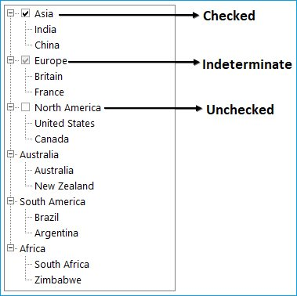

### Find CheckState changed

#### AfterInteractiveChecks Event

`InteractiveCheckBox` settings available for the TreeNodeAdv indicates whether the node will have an interactive checkbox. This AfterInteractiveChecks event will be triggered when the checked state of one or more nodes of a TreeViewAdv has changed due to this InteractiveCheckbox setting.

<b>Event Data</b>

The TreeNodeAdvEventHandler receives an argument of type `TreeNodeAdvEventArgs` containing data related to this event. The following TreeNodeAdvEventArgs members provide information specific to this event.

<b>Members Table</b>
<table>
<tr><th>
Members
</th><th>
Description</th></tr><tr><td>
Action</td><td>
Gets or sets the Syncfusion.Windows.Forms.Tools.TreeViewAdv Action associated with the event.</td></tr><tr><td>
Node</td><td>
Gets or sets the Syncfusion.Windows.Forms.Tools.TreeNodeAdv associated with the event.</td></tr></table>

#### BeforeCheck Event

This event is triggered when the checkbox is checked in the control. Below is an example which handles this event.

<b>Event Data</b>

The TreeNodeAdvBeforeCheckEventHandler receives an argument of type TreeNodeAdvBeforeCheckEventArgs containing data related to this event. The following `TreeNodeAdvBeforeCheckEventArgs` members provide information specific to this event.

<b>Members Table</b>
<table>
<tr><th>
Members
</th><th>
Description</th></tr><tr><td>
NewCheckState</td><td>
Gets the check state of the node.</td></tr><tr><td>
Cancel</td><td>
A Boolean property which indicates whether the event is to be canceled.</td></tr><tr><td>
Node</td><td>Gets the TreeNodeAdv which is associated with this action.</td></tr>
</table>




private void treeViewAdv1_BeforeCheck(object sender, Syncfusion.Windows.Forms.Tools.TreeNodeAdvBeforeCheckEventArgs e)
{
 	  if (Control.MouseButtons == MouseButtons.Left)
   		{
// Allow check or uncheck.
   		}
   	else
// Ignore all other ways to check/uncheck the node.
 	 	 e.Cancel = true;
}





Private Sub treeViewAdv1_BeforeCheck(ByVal sender As Object, ByVal e As Syncfusion.Windows.Forms.Tools.TreeNodeAdvBeforeCheckEventArgs)
If Control.MouseButtons = MouseButtons.Left Then
' Allow check or uncheck.
Else
' Ignore all other ways to check/uncheck the node.
e.Cancel = True
End If
End Sub




### AfterCheck Event

This event is triggered after the checkbox is checked in the control. Below is an example which handles this event.

<b>Event Data</b>

The `TreeNodeAdvEventHandler` receives an argument of type `TreeNodeAdvEventArgs` containing data related to this event. The following TreeNodeAdvEventArgs members provide information specific to this event.

<b>Members Table</b>
<table>
<tr><th>
Members
</th><th>
Description</th></tr><tr><td>
Action</td><td>
Gets or sets the Syncfusion.Windows.Forms.Tools.TreeViewAdvAction associated with the event.</td></tr><tr><td>
Node</td><td>
Gets or sets the Syncfusion.Windows.Forms.Tools.TreeNodeAdv associated with the event.</td></tr>
</table>

## Custom Controls

Tree Nodes can hold controls using this Custom Controls feature. This widens the functionality and view of the Tree nodes. With this feature, the nodes can hold controls like combo box, Calendar, Chart etc.,

Any custom control can be dragged and dropped to the form and selected using `TreeNodeAdv.CustomControls` property

To Add the custom control to a node as follows

<b>Step 1</b>: Create the instance of custom control and customize location and size of the custom control.




ComboBoxAdv comboBoxAdv =  new ComboBoxAdv();
this.comboBoxAdv.Size = new System.Drawing.Size(195, 19);
this.comboBoxAdv.Location = new System.Drawing.Point(83, 75);




<b>Step 2</b>: Add primitive to the node using TreeNode Primitive Collection Editor




treeNodePrimitive.PrimitiveType = Syncfusion.Windows.Forms.Tools.PredefinedPrimitiveTypes.CustomControl;
treeNode.Primitives.AddRange(new Syncfusion.Windows.Forms.Tools.TreeNodePrimitive[] {treeNodePrimitive});




<b>Step 3</b>:. Add the custom control to the node using TreeNodeAdv.CustomControl property




treeNode.CustomControl = this.comboBoxAdv;




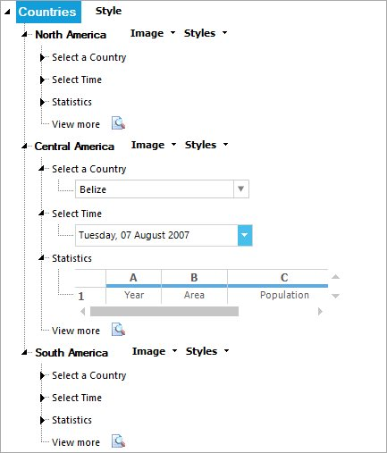

## Primitives

The TreeViewAdv control supports a set of primitive collections, that can be set through the Primitives Collection Editor available with each node in the `TreeViewAdv` controls.

To open the primitive collection editor, follow steps given below

1. Open “TreeNodeAdv NodeCollection Editor” and select any node in the TreeViewAdv

2. In the property window of selected node has Primitives property. Click the Primitives property to open the Primitive Collection Editor

    

    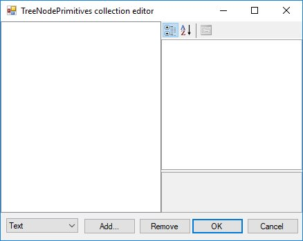

### LabelPrimitive

`LabelPrimitive` is used to display the text of the label.

To set the LabelPrimitive for an individual node follow the given steps.

1. Open the Primitives Collection Editor.

2. In the Bottom Left corner has combobox. Choose `Text` item in combobox and click the `Add` button.

3. Now the `LabelPrimitive` is added to that selected node.

   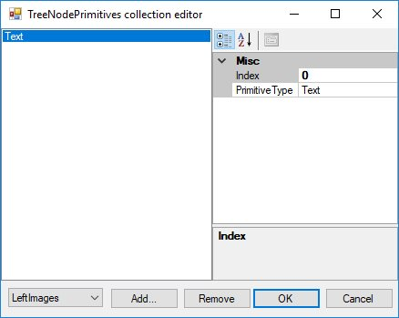

4. To save changes click the `OK` button.

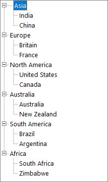

In the above image "Asia" node has label primitive. You can see the difference between "Asia" node and other parent nodes.

> Note: To set label primitive the `Text` property of the node cannot be null.

### LeftImagePrimitive

`LeftImagePrimitive` is used to display the image to the left of the nodes.

To set the `LeftImagePrimitive` for an individual node follow the given steps.

1. Open the Primitives Collection Editor. 

2. In the Bottom Left corner has combobox. Choose `Left Images` item in combobox and click the “Add” button.

3. Now the `LeftImagePrimitive` is added to that selected node.

    
 
4. To save changes click the "OK" button.
 
    

> Note: To set left image primitive the `LeftImageIndices` property of the node must be set. If we set LeftImage primitive alone then text of node will not be shown. So, we must set `LabelPrimitive` for that node.

### RightImagePrimitive

`RightImagePrimitive` is used to display the image that is added to the right of the nodes.

To set the `RightImagePrimitive` for an individual node follow the given steps.

1. Open the Primitives Collection Editor. 

2. In the Bottom Left corner has combobox. Choose `Right Images` item in combobox and click the "Add" button.

3. Now the `RightImagePrimitive` is added to that selected node.

    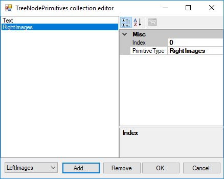

4. To save changes click the "OK" button.

    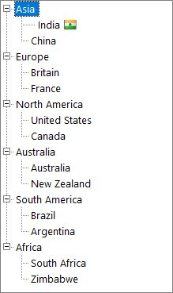

> Note: To set left image primitive the “RightImageIndices” property of the node must be set. If we set RightImage primitive alone then text of node will not be shown. So, we must set LabelPrimitive for that node.

### StateImagePrimitive

`StateImagePrimitive` is used to display the state image of the node depending on its state, whether expanded or collapsed.

To set the StateImagePrimitive for an individual node follow the given steps.

1. Open the Primitives Collection Editor. 

2. In the Bottom Left corner has combobox. Choose `State Images` item in combobox and click the "Add" button.

3. Now the `StateImagePrimitive` is added to that selected node.

    

4. To save changes click the "OK" button.

    

> Note: To set state image primitive, OpenImgIndex and ClosedImgIndex property of the node must be set.

### CheckBoxPrimitive

`CheckBoxPrimitive` is used to display the checkbox for the nodes. When user clicks on this, the node will be checked.

To set the `CheckBoxPrimitive` for an individual node follow the given steps.

1. Open the Primitives Collection Editor. 

2. In the Bottom Left corner has combobox. Choose "CheckBox" item in combobox and click the "Add" button.

3. Now the `CheckBoxPrimitive` is added to that selected node.

    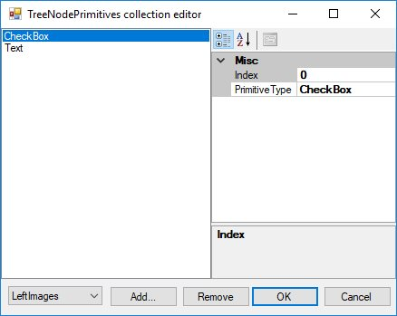

4. To save changes click the "OK" button.

    

> Note : To set check box primitive the “ShowCheckBox” property of the node must be set as true. If we set ShowCheckBox primitive alone then text of node will not be shown. So, we must set LabelPrimitive for that node.

### OptionButtonPrimitive

`OptionButtonPrimitive` is used to display the Option button available for the nodes. When the user clicks this primitive, the corresponding node will be selected.

To set the OptionButtonPrimitive for an individual node follow the given steps.

1. Open the Primitives Collection Editor. 

2. In the Bottom Left corner has combobox. Choose “OptionButton” item in combobox and click the “Add” button.

3. Now the OptionButtonPrimitive is added to that selected node.

    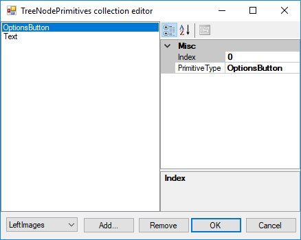

4. To save changes click the "OK" button.

    

> Note : To set check box primitive the `ShowOptionButton` property of the node must be set as true. If we set `ShowOptionButton` primitive alone then text of node will not be shown. So, we must set LabelPrimitive for that node.

### CustomControlPrimitives

`CustomControlPrimitives` displays the custom control for the nodes. User can use the functionality of the custom control primitive which is added to the nodes.

To set the CustomControlPrimitives for an individual node follow the given steps.

1. Open the Primitives Collection Editor. 

2. In the Bottom Left corner has combobox. Choose "CustomControl" item in combobox and click the "Add" button.

3. Now the `CustomControlPrimitives` is added to that selected node.

    

4. To save changes click the "OK" button.

    

## Expander in TreeNode

### ExpanderType

We can display Plus/Minus sign for the parent nodes by setting the property `ShowPlusMinus` to True. This will set Plus/Minus sign for all the parent nodes in TreeViewAdv except Office2016 and Metro styles.

In Office2016 and Metro style instead of plus/minus sign arrow has been shown. User can customize which expander type is needed for their requirement. It has two types, which are

*	Classic (show plus/minus)
*	Arrow 




this.treeViewAdv1.Style = TreeStyle.Office2016Colorful;
this.treeViewAdv1.ExpanderType = ExpanderType.Classic;





Me.treeViewAdv1.Style = TreeStyle.Metro
Me.treeViewAdv1.ExpanderType = ExpanderType.Classic

		


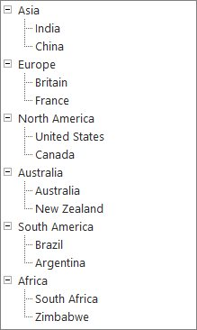

### Detect Node Collapse/Expand

#### BeforeExpand Event	

The `BeforeExpand` event will be raised when the plus is clicked again and when in expanded mode so that you can check the data source for changes. This topic explained in LoadOnDemand feature.
Use this event when you set the `TreeViewAdv.LoadOnDemand` property to true to add child nodes to the specified node before it is expanded.

<b>Event Table</b>

<table>
<tr>
<th>
Event</th><th>
Parameter</th><th>
Description</th></tr><tr><td>
BeforeExpand</td><td>
TreeViewAdvCancelableNodeEventArgs</td><td>
Handle this event when you want to do some processing of the specified node before it's expanded.</td></tr>
</table>

#### AfterExpand Event

`AfterExpand Event` is triggered when you want to do some processing of the specified node after it's expanded.

<b>Event Table</b>

<table>
<tr>
<th>
Event</th><th>
Parameter</th><th>
Description</th></tr><tr><td>
AfterExpand</td><td>
TreeViewAdvNodeEventArgs</td><td>
Handle this event when you want to do some processing of the specified node after it's expanded.</td></tr>
</table>

### Check Collapse and Expand Image changed

#### DefaultCollapseImageIndexChanged Event

`DefaultCollapseImageIndex` property of the TreeViewAdv sets the index of the default image for collapse button. This event is triggered when this property is changed.




private void treeViewAdv1_DefaultCollapseImageIndexChanged(object sender, EventArgs e)
{
    //The below line will be printed in the output window at run time.
    Console.Write("DefaultCollapseImageIndexChanged Event is raised ");
}





Private Sub treeViewAdv1_DefaultCollapseImageIndexChanged(ByVal sender As Object, ByVal e As EventArgs)
'The below line will be printed in the output window at run time.
Console.Write("DefaultCollapseImageIndexChanged Event is raised ")
End Sub




#### DefaultExpandImageIndexChanged Event

`DefaultExpandImageIndex` property of the TreeViewAdv sets the index of the default image for Expand button. The DefaultExpandImageIndexChanged event is triggered when this property is changed.




private void treeViewAdv1_DefaultExpandImageIndexChanged(object sender, EventArgs e)
{
//The below line will be printed in the output window at run time.
    Console.Write("DefaultExpandImageIndexChanged Event is raised ");
}




Private Sub treeViewAdv1_DefaultExpandImageIndexChanged(ByVal sender As Object, ByVal e As EventArgs)
'The below line will be printed in the output window at run time.
Console.Write("DefaultExpandImageIndexChanged Event is raised ")
End Sub




### NodeStateImageListChanged Event

`NodeStateImageList` holds the state images for the nodes. When this image list is changed then, the `NodeStateImageListChanged` event will be triggered.




private void treeViewAdv1_NodeStateImageListChanged(object sender, EventArgs e)
{
//The below line will be printed in the output window at run time.
    Console.Write("NodeStateImageListChanged Event is raised ");
}




Private Sub treeViewAdv1_NodeStateImageListChanged(ByVal sender As Object, ByVal e As EventArgs)
'The below line will be printed in the output window at run time.
Console.Write("NodeStateImageListChanged Event is raised ")
End Sub




## Image Customization

`TreeViewAdv` control can be customized with images for each of its actions. For example, collapse / expand state, plus / minus of the tree etc.,

### Left Image

The tree nodes can be set with left images using LeftImageList property in the property window. Left images for the individual nodes can be specified in `LeftImageIndices` property of individual nodes, using the TreeViewAdv Nodes Collection Editor.

The nodes with the images can be given an enhanced appearance using `LeftImagePadding`.

<b>Property Table</b>

<b>TreeViewAdv Property</b>

<table>
<tr>
<th>
Property</th><th>
Description</th></tr>
<tr>
<td>
LeftImageList</td><td>
Indicates the image list that holds the images to be drawn on the left of the Node. </td></tr>
</table>

<b>TreeNodeAdv Property</b>

<table>
<tr>
<th>
Property</th><th>
Description</th></tr>
<tr>
<td>
LeftImageIndices</td><td>
It is the image index to be drawn on the left of the node's text.</td></tr><tr><td>
LeftImagePadding</td><td>
It is the space provided between the LeftImage of the node and node.</td></tr><tr><td>
LeftStateImagePadding</td><td>
It is the space provided between, the LeftStateImage of the node and node.</td></tr>
</table>

To set the left images for all the nodes in treeview follow the below steps 

<b>Step 1</b>: Create image list and add images in it.

<b>Step 2</b>: Set `treeViewAdv1.LeftImageList` as newly created image list;




this. treeViewAdv1.LeftImageList = this.leftImageList;




Me.treeViewAdv1.LeftImageList = Me.leftImageList



			
<b>Step 3</b>: Now set the `LeftImageIndices` for each node in TreeViewAdv.




treeNodeAdv1.LeftImageIndices = new int[] {1};




<b>Step 4</b>:. Repeat step 3 until  set `LeftImageIndices` for all the nodes in treeview

### Right Image

The tree nodes can be set with right images using RightImageList property in the property window. Right images for the individual nodes can be specified in `RightImageIndices` property of individual nodes, using the TreeViewAdv Nodes Collection Editor.

The nodes with the images can be given an enhanced appearance using `RightImagePadding`.

<b>Property Table</b>

<b>TreeViewAdv Property</b>

<table>
<tr>
<th>
Property</th><th>
Description</th></tr>
<tr>
<td>
RightImageList</td><td>
This indicates the image list that holds the images to be drawn on the right of the Node.</td></tr>
</table>

<b>TreeNodeAdv Property</b>

<table>
<tr>
<th>
Property</th><th>
Description</th></tr>
<tr>
<td>
RightImageIndices</td><td>	It is the image index to be drawn on the right of the node's text.</td></tr><tr><td>
RightImagePadding</td><td>	It is the space provided between the RightImage of the node and node.</td></tr><tr><td>
RightStateImagePadding</td><td>	It is the space provided between, the RightStateImage of the node and node.</td></tr>
</table>

To set the Right images for all the nodes in treeview follow the below steps 

<b>Step 1</b>: Create image list and add images in it.

<b>Step 2</b>: Set `treeViewAdv1.RightImageList` as newly created image list;




this. treeViewAdv1.RightImageList = this.rightImageList;




Me.treeViewAdv1.RightImageList = Me.rightImageList



			
<b>Step 3</b>: Now set the `RightImageIndices` for each node in TreeViewAdv.




treeNodeAdv1.RightImageIndices = new int[] {1};




<b>Step 4</b>: Repeat step 3 until  set `RightImageIndices` for all the nodes in treeview

### State Image

Different images can be set for expand / collapse states of the node, using StateImageList property. To apply the left open and close images, set the `ClosedImgIndex` and the `OpenImgIndex` to the indices that points to the images in the StateImageList respectively. Nodes without child can be set with a separate image using `NoChildrenImageIndex`.

<b>Property Table</b>

<b>TreeViewAdv Property</b>

<table>
<tr>
<th>
Property</th><th>
Description</th></tr>
<tr>
<td>
ClosedImgIndex</td><td>
It is the StateImageList index value of the image that is displayed, when a tree node is collapsed.</td></tr><tr><td>
NoChildrenImageIndex</td><td>
It is the StateImageList index value of the image that is displayed, when a tree node has no children.</td></tr><tr><td>
NodeStateImageList</td><td>
Indicates the image list with images that are displayed instead of expand / collapse button.</td></tr><tr><td>
OpenImgIndex</td><td>
It is the StateImageList index value of the image that is displayed, when a tree node is expanded.</td></tr><tr><td>
StateImageList</td><td>
This indicates the image list that holds the images to be drawn based on the state of the Node.</td></tr>
</table>
		
>NOTE
>
>The above properties can also be set for individual nodes.

<b>TreeNodeAdv Property</b>

<table>
<tr>
<th>
Property</th><th>
Description</th></tr>
<tr>
<td>
ClosedImgIndex</td><td>
It is the image index in StateImageList where the node is collapsed.</td></tr><tr><td>
NoChildrenImageIndex</td><td>
It is the image index indicating the image in the StateImageList where the node has no children.</td></tr><tr><td>
OpenImgIndex</td><td>
It is the image index in StateImageList where the node is expanded.</td></tr>
</table>

To set the state images for all the nodes in treeview follow the below steps  

<b>Step 1</b>: Create image list and add images in it.

<b>Step 2</b>: Set "treeViewAdv1.StateImageList" as newly created image list;





this. treeViewAdv1.StateImageList = this.stateImageList;





Me.treeViewAdv1. StateImageList = Me.stateImageList





<b>Step 3</b>: Now set the OpenImgIndex and ClosedImgIndex for each node in TreeViewAdv.





treeNodeAdv1.OpenImgIndex = 1;
treeNodeAdv1.CloseImgIndex = 1;





<b>Step 4</b>: Repeat step 3 until  set OpenImgIndex and ClosedImgIndex for all the nodes in treeview
			 

### Customizing the Image Size

The `ImageSize` property let you enhance the image size for a `TreeNodeAdv`. By default, the `TreeViewAdv` control displays the image size depending on the size of the image that is set in the image list. 




this.leftImageList.ImageSize = new System.Drawing.Size(16, 16);
this.rightImageList.ImageSize = new System.Drawing.Size(16, 16);
this.stateImageList.ImageSize = new System.Drawing.Size(16, 16);




Me.leftImageList.ImageSize = New System.Drawing.Size(16, 16)
Me.rightImageList.ImageSize = New System.Drawing.Size(16, 16)
Me.stateImageList.ImageSize = New System.Drawing.Size(15, 15)




### Expander Images

When child nodes are added to a node, automatically the expand / collapse (+/-) images are set by default, to the parent node, which indicates whether the nodes are opened or closed. These default images can be replaced with custom images using `NodeStateImageList` property.

Images to be displayed for the expanded and collapsed nodes can be specified in the `DefaultExpandImageIndex` and `DefaultCollapseImageIndex` properties respectively.

Images for individual nodes can be specified in `treeNodeAdv.ExpandImageIndex` / `treeNodeAdv.CollapseImageIndex` properties. Setting these properties will override the expand / collapse image settings that is applied for the control.

<b>Property Table</b>

<b>TreeViewAdv Property</b>

<table>
<tr>
<th>
Property</th><th>
Description</th></tr>
<tr>
<td>
Expanded</td><td>
Indicates if the node is expanded.</td></tr><tr><td>
DefaultCollapseImageIndex</td><td>
It is the default image index when a tree node is collapsed.</td></tr><tr><td>
DefaultExpandImageIndex</td><td>
It is the default image index when a tree node is expanded.</td></tr><tr><td>
NodeStateImageList</td><td>
Indicates the image list with images that are displayed instead of expand / collapse button.</td></tr>
</table>

<b>TreeNodeAdv Property</b>

<table>
<tr>
<th>
Property</th><th>
Description</th></tr>
<tr>
<td>
CollapseImageIndex</td><td>
It is the image index for collapse button.</td></tr><tr><td>
ExpandImageIndex</td><td>
It is the image index for expand button.</td></tr>
</table>

To set the expander images for all the nodes in treeview follow the below steps

<b>Step 1</b>: Create image list and add images in it.

<b>Step 2</b>: Set “treeViewAdv1.NodeStateImageList “ as newly created image list;





this. treeViewAdv1. NodeStateImageList = this.nodeStateImageList;





Me.treeViewAdv1. NodeStateImageList = Me.nodeStateImageList





<b>Step 3</b>: Now set the ExpandImageIndex and CollapseImageIndex for each node in TreeViewAdv.





treeNodeAdv1. ExpandImageIndex = 1;
treeNodeAdv1. CollapseImageIndex = 0;





<b>Step 4</b>: Repeat step 3 until  set the ExpandImageIndex and CollapseImageIndex  for all the nodes in treeview
			 
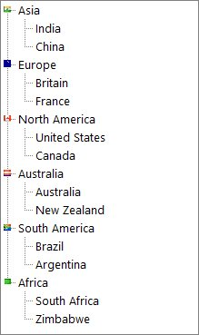

### Line Images

TreeViewAdv control provides options to customize the lines which connects the nodes and can hold custom images for expand / collapse operations. These properties are discussed in this section.

#### Line and Plus/Minus images

`ShowRootLines` when disabled, does not display the connecting lines for root items alone. That is, show lines will be displayed for rest of the items except for the level-1 items which will not be connected to one another with show lines.

`ShowLines` when disabled, does not display the connecting lines for the entire tree control. The hierarchical lines can be customized by setting the type of lines to be used and the color using the LineStyle and LineColor properties.

The standard +/- signs for the expand/collapse buttons in the TreeViewAdv can be replaced with custom images by setting the ImageList to the `NodeStateImageList` property of the TreeViewAdv. 

`ShowPlusMinus` when disabled, does not display the plus / minus images for the parent nodes, i.e., the expand/collapse images will not be displayed.

<b>Property Table</b>

<b>TreeViewAdv Property</b>

<table>
<tr>
<th>
Property</th><th>
Description</th></tr>
<tr>
<td>
LineColor</td><td>
Indicates the color of the tree lines.</td></tr><tr><td>
LineStyle</td><td>
Indicates the line styles of the tree lines.</td></tr><tr><td>
ShowLines</td><td>
Indicates if the tree lines are visible.</td></tr><tr><td>
ShowPlusMinus</td><td>
Indicates if the plus or minus controls are visible for the tree.</td></tr><tr><td>
ShowRootLines</td><td>
Indicates whether lines are displayed between root nodes.</td></tr>
</table>




this.treeViewAdv1.LineColor = System.Drawing.Color.Black;
this.treeViewAdv1.LineStyle = System.Drawing.Drawing2D.DashStyle.Dash;
this.treeViewAdv1.ShowLines = true;
this.treeViewAdv1.ShowPlusMinus = true;
this.treeViewAdv1.ShowRootLines = true;




Me.treeViewAdv1.LineColor = System.Drawing.Color.Black
Me.treeViewAdv1.LineStyle = System.Drawing.Drawing2D.DashStyle.Dash
Me.treeViewAdv1.ShowLines = True
Me.treeViewAdv1.ShowPlusMinus = True
Me.treeViewAdv1.ShowRootLines = True




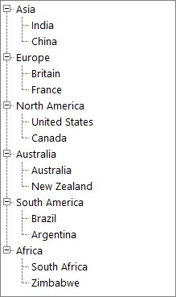

>NOTE
>
>ShowPlusMinus properties can also be set for individual nodes.

### Image Overlaying

The steps below will show how you could draw overlay images on the images associated with the tree nodes.
* Set the TreeViewAdv’s OwnerDrawNodes property to true.
* Handle the TreeViewAdv’s AfterNodePaint event as shown in code below to perform overlaying of images. The below code snippet shows overlaying LeftImages. The same code snippet can be used for overlaying RightImages and StateImages also by replacing LeftImagesX with RightImagesX and StateImagesX respectively. 




private void treeViewAdv1_AfterNodePaint(object sender, Syncfusion.Windows.Forms.Tools.TreeNodeAdvPaintEventArgs e)
{
// Suppose you wish to draw an overlay image on the image associated with the selected node.
    			TreeNodeAdv node = this.treeViewAdv1.SelectedNode;
// Get the position of the node's image.
Point point = new Point(node.LeftImagesX, node.TextAndImageBounds.Y);
// Perform image drawing.
e.Graphics.DrawImage(overlayImage, point);
}




Private Sub treeViewAdv1_AfterNodePaint(sender As Object, e As Syncfusion.Windows.Forms.Tools.TreeNodeAdvPaintEventArgs) Handles treeViewAdv1.AfterNodePaint
' Suppose you wish to draw an overlay image on the image associated with the selected node.
Dim node As TreeNodeAdv = Me.treeViewAdv1.SelectedNode
' Get the position of the node's image.
Dim point As New Point(node.LeftImagesX, node.TextAndImageBounds.Y)
' Perform image drawing.
e.Graphics.DrawImage(overlayImage, point)
End Sub




## Editing the Node

### LabelEdit

Indicates whether the label text of the tree nodes can be edited. By default, it is false. To handle `BeforeEdit` event and `AfterEdit` LabelEdit property must be set as true.




this.treeViewAdv1.LableEdit = true;




Me.treeViewadv1.LabelEdit = True




### Detect Node Editing

#### NodeEditorValidating Event
This event is used to validate a new node label entered by the user.

<b>Event Data</b>

The TreeNodeAdvCancelableEditEventHandler receives an argument of type TreeNodeAdvCancelableEditEventArgs containing data related to this event. The following TreeNodeAdvCancelableEditEventArgs members provide information specific to this event.

<b>Members table</b>

<table>
<tr>
<th>
Members</th><th>
Description</th></tr>
<tr>
<td>
Node</td><td>
Indicates a TreeNodeAdv which is currently edited.</td></tr><tr><td>
Label</td><td>
A new text for the node.</td></tr><tr><td>
Cancel</td><td>
Indicates whether the event should be canceled.</td></tr><tr><td>
ContinueEditing</td><td>
Indicates whether editing should end now.</td></tr>
</table>

<b>How to Validate Node Label Text</b>

This topic shows how you can validate the text of the label of a node in the TreeViewAdv control. You need to listen to the NodeEditorValidating event of the TreeViewAdv control to validate the node’s label text entered by the user. The code sample below demonstrates how you can prevent blank labels in a node.




private void treeViewAdv1_NodeEditorValidating(object sender, Syncfusion.Windows.Forms.Tools.TreeNodeAdvCancelableEditEventArgs e)
	{
   		if(e.Label.Length == 0)
    		{
                // Cancel the label edit action, inform the user, and place the node in edit mode again. 
          		e.Cancel = true;
          		MessageBox.Show("The label cannot be blank", "Node Label Edit");
		        // To end editing mode,call:
		 	    e.ContinueEditing = False;
     		}	
	}




Private  Sub treeViewAdv1_NodeEditorValidating(ByVal sender As Object, ByVal e As Syncfusion.Windows.Forms.Tools.TreeNodeAdvCancelableEditEventArgs)
		If e.Label.Length = 0 Then
        ' Cancel the label edit action, inform the user, and place the node in edit mode again. 
		e.Cancel = True
		MessageBox.Show("The label cannot be blank", "Node Label Edit")
		' To end editing mode,call: e.ContinueEditing = False;
		End If
End Sub




#### NodeEditorValidated Event

This event is raised after the newly entered text in the Node editor gets stored.

<b>Event Data</b>

The event handler receives an argument of type TreeNodeAdvEditEventArgs containing data related to this event.
The following TreeNodeAdvEditEventArgs properties provide information specific to this event.

<b>Members table</b>

<table>
<tr>
<th>
Members</th><th>
Description</th></tr>
<tr>
<td>
Label</td><td>
Returns the label for the node.</td></tr><tr><td>
Node</td><td>
Returns the TreeNodeAdv that is currently being edited.</td></tr>
</table>




private void treeViewAdv1_NodeEditorValidated(object sender, Syncfusion.Windows.Forms.Tools.TreeNodeAdvEditEventArgs e)
{
//This prints the label for the node in the output window at run time.
Console.Write("Label :" + e.Label.ToString());
//This prints the TreeNodeAdv associated with the event in the output window at run time.
Console.Write("TreeNodeAdv :" + e.Node.ToString());
}




Private Sub treeViewAdv1_NodeEditorValidated(ByVal sender As Object, ByVal e As Syncfusion.Windows.Forms.Tools.TreeNodeAdvEditEventArgs)

'This prints the TreeNodeAdv action associated with the event in the output window at run time.
Console.Write("Label :" + e.Action.ToString())

'This prints the TreeNodeAdv associated with the event in the output window at run time.
Console.Write("TreeNodeAdv :" + e.Node.ToString())
End Sub




#### NodeEditorValidateString Event

This event is triggered when the text entered by the user changes in the Node editor control.

<b>Event Data</b>

The event handler receives an argument of type TreeNodeAdvEditEventArgs containing data related to this event. The following TreeNodeAdvEditEventArgs properties provide information specific to this event.

<b>Members table</b>

<table>
<tr>
<th>
Members</th><th>
Description</th></tr>
<tr>
<td>
Cancel</td><td>
Indicates whether the event should be canceled.</td></tr><tr><td>
ContinueEditing</td><td>
Indicates whether editing should end now.</td></tr><tr><td>
Label</td><td>
Returns the label for the node.</td></tr><tr><td>
Node</td><td>Returns the TreeNodeAdv that is currently being edited.</td></tr>
</table>




private void treeViewAdv1_NodeEditorValidateString(object sender, Syncfusion.Windows.Forms.Tools.TreeNodeAdvCancelableEditEventArgs e)
{

//The below code cancels the event
    e.Cancel = true;

//This property is consulted only when Cancel is set to true. 

//If you Cancel the operation and if this property is set to false,editing mode will end; 

//otherwise editing mode will be preserved. Default is true.
    e.ContinueEditing = false;

//This prints the label for the node in the output window at run time.
    Console.Write("Label :" + e.Label.ToString());

//This prints the treenodeadv associated with the event in the output window at run time.
    Console.Write("TreeNodeAdv :" + e.Node.ToString());
}





Private Sub treeViewAdv1_NodeEditorValidateString(ByVal sender As Object, ByVal e As Syncfusion.Windows.Forms.Tools.TreeNodeAdvCancelableEditEventArgs)

'The below code cancels the event
e.Cancel = true

'This property is consulted only when Cancel is set to true. 

'If you Cancel the operation and if this property is set to false,editing mode will end; 

'otherwise editing mode will be preserved. Default is true.
e.ContinueEditing = False

'This prints the treenodeadv action associated with the event in the output window at run time.
Console.Write("Label :" + e.Action.ToString())

'This prints the treenodeadv associated with the event in the output window at run time.
Console.Write("TreeNodeAdv :" + e.Node.ToString())
End Sub




### BeforeEdit Event

This event is raised before the node goes into edit mode. Below are examples which handles the BeforeEdit event.

#### Event Data

The TreeNodeAdvBeforeEditEventHandler receives an argument of type TreeNodeAdvBeforeEditEventArgs containing data related to this event. The following  TreeNodeAdvBeforeEditEventArgs' members provide information specific to this event.

Members Table

<table>
<tr>
<th>
Members</th><th>
Description</th></tr>
<tr>
<td>
Node</td><td>
This returns a TreeNodeAdv.</td></tr>
<tr>
<td>
TextBox</td><td>
Returns the textbox that is used to edit the node.</td></tr>
<tr>
<td>
Cancel</td><td>
Gets or Sets a value indicating whether the event should be canceled.</td></tr>
</table>

#### Method to Set UnEditable Nodes

Methods to make a node completely un editable even when the,

1. Node is visible.
2. Node is clickable.

BeforeEdit event can be used for this purpose. In this example, the Parent Nodes are made without editable option. TreeNodeAdvBeforeEditEventArgs.Node indicates the target node for editing.

The desired condition is checked on that node and based on the result, the TreeNodeAdvBeforeEditEventArgs.Cancel property is set appropriately.




private void treeViewAdv1_BeforeEdit(object sender, Syncfusion.Windows.Forms.Tools.TreeNodeAdvBeforeEditEventArgs e)
{

// Check if they are parent nodes.
    if ((e.Node.Text == "Node0") || (e.Node.Text == "Node5")) 
    {
        e.Cancel = true;
    }
}





Private Sub treeViewAdv1_BeforeEdit(ByVal sender As Object, ByVal e As Syncfusion.Windows.Forms.Tools.TreeNodeAdvBeforeEditEventArgs)

' Check if they are parent nodes.
If (e.Node.Text = "Node0") OrElse (e.Node.Text = "Node5") Then
e.Cancel = True
End If
End Sub




<b>Cancel Read / Write property for particular user nodes</b>

By canceling the BeforeEdit event for particular nodes of particular users, the Read/Write property can be canceled. 




private void treeViewAdv1_BeforeEdit(object sender, Syncfusion.Windows.Forms.Tools.TreeNodeAdvBeforeEditEventArgs e)
{

// By cancel the BeforeEdit event for particular nodes helps to cancel the Read/Write property of that nodes. 
    if(username=="user1")
    {
        if ((e.Node.Text == "Node0") || (e.Node.Text == "Node5")||(e.Node.Text == "Node3")||(e.Node.Text == "Node8")) 
        {
            e.Cancel = true;
        }
    }
    else if(username=="user2")
    if ((e.Node.Text == "Node2") || (e.Node.Text == "Node4")||(e.Node.Text == "Node6")||(e.Node.Text == "Node10")) 
    {
        e.Cancel = true;
    }
}





Private Sub treeViewAdv1_BeforeEdit(ByVal sender As Object, ByVal e As Syncfusion.Windows.Forms.Tools.TreeNodeAdvBeforeEditEventArgs)

' By cancel the BeforeEdit event for particular nodes helps to cancel the Read/Write property of that nodes. 
If username="user1" Then
If (e.Node.Text = "Node0") OrElse (e.Node.Text = "Node5") OrElse (e.Node.Text = "Node3") OrElse (e.Node.Text = "Node8") Then
e.Cancel = True
End If
Else If username="user2" Then
If (e.Node.Text = "Node2") OrElse (e.Node.Text = "Node4") OrElse (e.Node.Text = "Node6") OrElse (e.Node.Text = "Node10") Then
e.Cancel = True
End If
End If
End Sub




### Leave Event

This event is triggered when the control is no longer the active control of the form. An example which uses the Leave event is as follows.

How to Use Delete Key for Deleting and as a Shortcut to BarItems / MenuItems of TreeViewAdv

The form contains a treeViewAdv with nodes with LabelEdit property set to true as well as BarItems or MenuItems with Delete key as their shortcut. 

After editing the node by pressing F2, if the Delete key is pressed, to avoid the menu shortcut from getting triggered and trigger the deletion of text in the editor, follow the procedure below.

Disable the menu shortcut as soon as the editor gets focus and enable the shortcut as soon as the editor loses focus. It can be done by handling the TreeViewAdv's BeforeEdit event, setting the bar item's shortcut to None and listening to the node's edit textbox's Leave event. Within this Leave event handler, set the bar item's shortcut back to Del.




TextBox editor;
private void treeViewAdv1_BeforeEdit(object sender, Syncfusion.Windows.Forms.Tools.TreeNodeAdvBeforeEditEventArgs e)
{
    this.editor = e.TextBox;
    this.editor.Leave += new EventHandler(editor_Leave);

// Disabling  the menu shortcut as soon as the editor gets focused.
    this.barItem1.Shortcut = Shortcut.None;
}

// Enabling the shortcut as soon as the editor loses focus.
private void editor_Leave(object sender, EventArgs args)
{
    this.barItem1.Shortcut = Shortcut.Del;
}





Private editor As TextBox
Private Sub treeViewAdv1_BeforeEdit(ByVal sender As Object, ByVal e As Syncfusion.Windows.Forms.Tools.TreeNodeAdvBeforeEditEventArgs)
Me.editor = e.TextBox
AddHandler editor.Leave, AddressOf editor_Leave

'Disabling the menu shortcut as soon as the editor gets focused.
Me.barItem1.Shortcut = Shortcut.None
End Sub
Private Sub editor_Leave(ByVal sender As Object, ByVal args As EventArgs)

' Enabling the shortcut as soon as the editor loses focus.
Me.barItem1.Shortcut = Shortcut.Del
End Sub




## NodeSelection

### SelectionMode

During drag and drop operation of the tree nodes, a single node or same level nodes or multi-level nodes can be selected and dragged based on the selection mode set for the treeview control. `SelectionMode` property is used for this purpose.

We can select nodes by three modes, which are

* Single (Default SelectionMode)

    The user can only select one node at a time and implement the drag-drop operation in the TreeViewAdv

* MultiSelectSameLevel

    The user can only select nodes of the same level, i.e. only child nodes or only parent nodes

* MultiSelectAll

    The user can select multiple nodes for implementing the DragDrop operation in the TreeViewAdv.

### SelectedNode
	
`SelectedNode` property holds the currently selected tree node.

### SelectedNodes

`SelectedNodes` property holds the collection of selected nodes. 
If the SelectionMode is single, then SelectedNode and SelectedNodes holds the same node.

> Note : This Property will be effective only when the SelectionMode is MultiSelectSameLevel or MultiSelectAll

## Programmatic selection

TreeViewAdv allows to select the items programmatically using both `SelectedItem` and `SelectedItems` property.

### SelectedItem

When the selection mode is `Single`, programmatically select an item by setting the underlying object to the `SelectedItem` property.




public partial class Form2 : Form
{
    private TreeViewAdv treeViewAdv1;

    public Form2()
    {
        InitializeComponent();
        this.treeViewAdv1 = new TreeViewAdv();
        this.treeViewAdv1.ItemHeight = 25;
        this.treeViewAdv1.Location = new Point(100, 100);
        this.treeViewAdv1.Size = new Size(270, 300);
        this.treeViewAdv1.SelectionMode = TreeSelectionMode.MultiSelectAll;
        this.treeViewAdv1.SelfRelationRootValue = "";
        this.treeViewAdv1.ShowCheckBoxes = true;
        this.treeViewAdv1.ShowLines = false;
        this.treeViewAdv1.ThemeName = "Office2019Colorful";

        DataTable dataTable1 = new DataTable("Continent");
        dataTable1.Columns.Add("Name", typeof(string));
        dataTable1.Columns.Add("CountryID", typeof(string));
        dataTable1.Columns.Add("ContinentID", typeof(string));
        dataTable1.Columns.Add("Capital", typeof(string));
        dataTable1.Columns.Add("IsActive", typeof(bool));
        dataTable1.Rows.Add("Asia", "1", "", "Asia", true);
        dataTable1.Rows.Add("India", "2", "1", "Delhi", false);
        dataTable1.Rows.Add("China", "3", "1", "Beijing", true);
        dataTable1.Rows.Add("North America", "4", "", "USA", false);
        dataTable1.Rows.Add("United States", "5", "4", "New York", true);
        dataTable1.Rows.Add("Canada", "6", "4", "Ottawa", false);
        dataTable1.Rows.Add("Europe", "7", "", "EU", true);
        dataTable1.Rows.Add("UK", "8", "7", "London", false);
        dataTable1.Rows.Add("Russia", "9", "7", "Moscow", true);
        dataTable1.Rows.Add("Africa", "10", "", "SA", false);
        dataTable1.Rows.Add("South Africa", "11", "10", "Cape Town", true);
        dataTable1.Rows.Add("Zimbabwe", "12", "10", "Harare", false);
        dataTable1.Rows.Add("Maharashtra", "13", "2", "Bombay", true);
        dataTable1.Rows.Add("Tamil Nadu", "14", "2", "Madras", false);
        dataTable1.Rows.Add("Mumbai", "15", "13", "Borivali", true);
        dataTable1.Rows.Add("Chennai", "16", "14", "Koyambedu", false);
        dataTable1.Rows.Add("New York", "17", "5", "NY", true);
        dataTable1.Rows.Add("Albany", "18", "17", "AL", false);
        dataTable1.Rows.Add("Northen Cape", "19", "11", "NC", true);
        dataTable1.Rows.Add("CapeTown", "20", "19", "Town", false);
        dataTable1.Rows.Add("England", "21", "8", "ENG", true);
        dataTable1.Rows.Add("London", "22", "21", "UK", false);
        dataTable1.Rows.Add("Shanghai", "23", "3", "SH", true);
        dataTable1.Rows.Add("Republics", "24", "9", "Repb", false);
        dataTable1.Rows.Add("Kazan", "25", "24", "Kz", true);
        dataTable1.Rows.Add("Victoria", "26", "12", "VC", false);
        dataTable1.Rows.Add("Masvingo", "27", "26", "Mas", true);
        dataTable1.Rows.Add("Chengudu", "28", "23", "Chen", false);
        dataTable1.Rows.Add("Ontario", "29", "6", "Ont", true);
        dataTable1.Rows.Add("Toronto", "30", "29", "TR", true);

        this.treeViewAdv1.DataMember = "Continent";
        this.treeViewAdv1.DisplayMember = "Name";
        this.treeViewAdv1.ParentMember = "ContinentID";
        this.treeViewAdv1.ChildMember = "CountryID";
        this.treeViewAdv1.ValueMember = "Capital";
        this.treeViewAdv1.CheckedMember = "IsActive";
        this.treeViewAdv1.DataSource = dataTable1;

        this.treeViewAdv1.SelectedItem = dataTable1.Rows[3];
        this.Controls.Add(treeViewAdv1);
    }
}




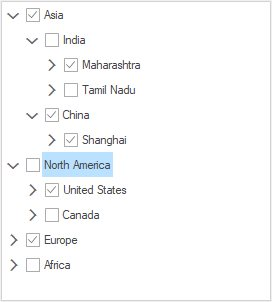

### SelectedItems

When the selection mode is `MultiSelectSameLevel` or `MultiSelectAll`, programmatically select more than one item by adding the underlying object to the `SelectedItems` property.




public partial class Form2 : Form
{
    private TreeViewAdv treeViewAdv1;

    public Form2()
    {
        InitializeComponent();
        this.treeViewAdv1 = new TreeViewAdv();
        this.treeViewAdv1.ItemHeight = 25;
        this.treeViewAdv1.Location = new Point(100, 100);
        this.treeViewAdv1.Size = new Size(270, 300);
        this.treeViewAdv1.SelectionMode = TreeSelectionMode.MultiSelectAll;
        this.treeViewAdv1.SelfRelationRootValue = "";
        this.treeViewAdv1.ShowCheckBoxes = true;
        this.treeViewAdv1.ShowLines = false;
        this.treeViewAdv1.ThemeName = "Office2019Colorful";

        DataTable dataTable1 = new DataTable("Continent");
        dataTable1.Columns.Add("Name", typeof(string));
        dataTable1.Columns.Add("CountryID", typeof(string));
        dataTable1.Columns.Add("ContinentID", typeof(string));
        dataTable1.Columns.Add("Capital", typeof(string));
        dataTable1.Columns.Add("IsActive", typeof(bool));
        dataTable1.Rows.Add("Asia", "1", "", "Asia", true);
        dataTable1.Rows.Add("India", "2", "1", "Delhi", false);
        dataTable1.Rows.Add("China", "3", "1", "Beijing", true);
        dataTable1.Rows.Add("North America", "4", "", "USA", false);
        dataTable1.Rows.Add("United States", "5", "4", "New York", true);
        dataTable1.Rows.Add("Canada", "6", "4", "Ottawa", false);
        dataTable1.Rows.Add("Europe", "7", "", "EU", true);
        dataTable1.Rows.Add("UK", "8", "7", "London", false);
        dataTable1.Rows.Add("Russia", "9", "7", "Moscow", true);
        dataTable1.Rows.Add("Africa", "10", "", "SA", false);
        dataTable1.Rows.Add("South Africa", "11", "10", "Cape Town", true);
        dataTable1.Rows.Add("Zimbabwe", "12", "10", "Harare", false);
        dataTable1.Rows.Add("Maharashtra", "13", "2", "Bombay", true);
        dataTable1.Rows.Add("Tamil Nadu", "14", "2", "Madras", false);
        dataTable1.Rows.Add("Mumbai", "15", "13", "Borivali", true);
        dataTable1.Rows.Add("Chennai", "16", "14", "Koyambedu", false);
        dataTable1.Rows.Add("New York", "17", "5", "NY", true);
        dataTable1.Rows.Add("Albany", "18", "17", "AL", false);
        dataTable1.Rows.Add("Northen Cape", "19", "11", "NC", true);
        dataTable1.Rows.Add("CapeTown", "20", "19", "Town", false);
        dataTable1.Rows.Add("England", "21", "8", "ENG", true);
        dataTable1.Rows.Add("London", "22", "21", "UK", false);
        dataTable1.Rows.Add("Shanghai", "23", "3", "SH", true);
        dataTable1.Rows.Add("Republics", "24", "9", "Repb", false);
        dataTable1.Rows.Add("Kazan", "25", "24", "Kz", true);
        dataTable1.Rows.Add("Victoria", "26", "12", "VC", false);
        dataTable1.Rows.Add("Masvingo", "27", "26", "Mas", true);
        dataTable1.Rows.Add("Chengudu", "28", "23", "Chen", false);
        dataTable1.Rows.Add("Ontario", "29", "6", "Ont", true);
        dataTable1.Rows.Add("Toronto", "30", "29", "TR", true);

        this.treeViewAdv1.DataMember = "Continent";
        this.treeViewAdv1.DisplayMember = "Name";
        this.treeViewAdv1.ParentMember = "ContinentID";
        this.treeViewAdv1.ChildMember = "CountryID";
        this.treeViewAdv1.ValueMember = "Capital";
        this.treeViewAdv1.CheckedMember = "IsActive";
        this.treeViewAdv1.DataSource = dataTable1;

        BindingList<object> rows = new BindingList<object>();
        rows.Add(dataTable1.Rows[0]);
        rows.Add(dataTable1.Rows[1]);
        rows.Add(dataTable1.Rows[13]);
        treeViewAdv1.SelectedItems = rows;
        this.Controls.Add(treeViewAdv1);
    }
}




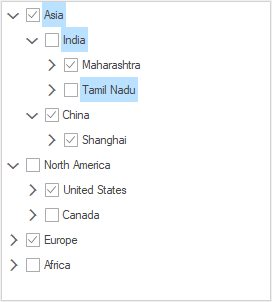

<b>Property Table</b>

<b>TreeViewAdv Property</b>

<table>
<tr>
<th>
Property</th><th>
Description</th></tr>
<tr>
<td>

SelectionMode</td><td>
Indicates selection mode of the tree</td></tr><tr><td>
SelectedNode</td><td>
It holds currently selected node in tree</td></tr><tr><td>
SelectedNodes</td><td>
It holds collection of more than one selected nodes  in tree</td></tr>
</table>




this.treeViewAdv1.SelectionMode = TreeSelectionMode.MultiSelectSameLevel;		




Me.treeViewAdv1.SelectionMode = TreeSelectionMode.MultiSelectSameLevel




<b>Extending the Selection</b>

We can extend the selection of the nodes using ExtendSelectionTo method. 

<b>Methods Table</b>

<table>
<tr>
<th>
Methods</th><th>
Parameter</th></tr>
<tr>
<td>
ExtendSelectionTo</td><td>
Extends the selection of the node to a specified node.SelectionNode - Represents a treeNodeAdv.</td></tr>
<tr>
<td>
ExtendSelectionTo (Overloaded)</td><td>
SelectionNode - Represents a treeNodeAdv.removeCurrentMultipleSelection - Indicates whether or not any current selection should be removed.</td></tr>
</table>

> Note
>
> This method will be effective only when the SelectionMode is MultiSelectSameLevel or MultiSelectAll.




//Extend Selection using below method
this.treeViewAdv1.ExtendSelectionTo(this.treeNode);

//Overloaded Method
this.treeViewAdv1.ExtendSelectionTo(this.treeNode, false);





'Extend Selection using below method
Me.treeViewAdv1.ExtendSelectionTo(Me.treeNode)

'Overloaded Method
Me.treeViewAdv1.ExtendSelectionTo(Me.treeNode, False)




<b>On Focus/ Off Focus</b>

<b>ShouldSelectNodeOnEnter:</b>

When ShouldSelectNodeOnEnter property is enabled, default node can be selected if treeview control gains focus. By default , it will be set as true;

<b>HideSelection</b>

When `HideSelection` property is enabled, it will hide the selected nodes if the treeview control has lost its focus. It should be set as false to highlight the selected nodes .By default, it will be set as false.

<b>Property Table</b>

<table>
<tr>
<th>
TreeViewAdv Property</th><th>
Description</th></tr>
<tr>
<td>
ShouldSelectNodeOnEnter</td><td>
Indicates whether a default node should be selected when the TreeViewAdv control gains focus.</td></tr><tr><td>
HideSelection</td><td>
Indicates if the TreeViewAdv hides its selected nodes when not focused.</td></tr>
</table>

### AllowMouseBasedSelection and AllowKeyboardSearch

Setting `AllowKeyboardSearch` property of the treeview to true, will allow the user to search for a node by typing the name of the node using the keyboard. User have to ensure that the TreeViewAdv control is focused while searching.

By setting the `AllowMouseBasedSelection` property to true, multiple nodes can be selected with mouse down and these selected nodes can be dragged.

Property Table

<table>
<tr>
<th>
TreeViewAdv Properties</th><th>
Description</th></tr>
<tr>
<td>
AllowKeyboardSearch</td><td>
Gets or sets a value indicating if keyboard based searching should be allowed.</td></tr>
<tr>
<td>
AllowMouseBasedSelection</td><td>
Indicates if multiple nodes can be selected with mouse down and drag.</td></tr>
</table>




this.treeViewAdv1.AllowKeyboardSearch = false;
this.treeViewAdv1.AllowMouseBasedSelection = true; 





Me.treeViewAdv1.AllowKeyboardSearch = False
Me.treeViewAdv1.AllowMouseBasedSelection = True




### RMouseDownNode

`RMouseDownNode` property holds the node on which the user did a right-mouse down.

This property will return a non-null value only when the user has his mouse down or when the context menu is being shown for the tree. If the user right-clicked in the empty region then this property will return null.

When the user instead used the keyboard to invoke the context menu (via Shift+F10) then this property will return the currently selected node and the menu will also appear beside the selected node. 

#### Mouse Events

##### MouseDown and MouseUp Event

The event, MouseDown is raised when the mouse pointer is over the control and a mouse button is pressed. The event, MouseUp is raised when the mouse pointer is over the control and a mouse button is released. An example which uses the MouseDown and MouseUp events are as follows.

<b>Event Data</b>

The MouseEventHandler receives an argument of type MouseEventArgs containing data related to this event. The following MouseEventArgs members provide information specific to this event.

<b>Members Table</b>

<table>
<tr>
<th>
Members</th><th>
Description</th></tr>
<tr>
<td>
Button</td><td>
Gets which mouse button was pressed.</td></tr>
<tr>
<td>
Clicks</td><td>
Gets the number of times the mouse button was pressed and released.</td></tr>
<tr>
<td>
Delta</td><td>
Gets a signed count of number of detects the mouse wheel has rotated. A detect is one notch of the mouse wheel.</td></tr>
<tr>
<td>
Location</td><td>
Gets the location of mouse when during generating mouse events.</td></tr>
<tr>
<td>
X</td><td>
Gets the X - coordinate of the mouse when during generating mouse events.</td></tr>
<tr>
<td>
Y</td><td>
Gets the Y - coordinate of the mouse during generating mouse events.</td></tr>
</table>




private void treeViewAdv1_MouseDown(object sender, MouseEventArgs e) 
{ 

// Suspends the painting of the control.
    if(e.Button == MouseButtons.Right)
    {
        this.treeViewAdv1.BeginUpdate();
        if(this.treeViewAdv1.RMouseDownNode!=null) 
        if (this.treeViewAdv1.RMouseDownNode.TextBounds.Contains(this .treeViewAdv1.LastMousePositionToClient())) 
        {

// Selected Node is set to RMouseDownNode.
            this.treeViewAdv1.SelectedNode = this.treeViewAdv1.RMouseDownNode; 
        }
    } 
} 

private void treeViewAdv1_MouseUp(object sender, MouseEventArgs e) 
{ 

// Resumes the painting of the control.
     this.treeViewAdv1.EndUpdate(true); 
} 





Private Sub treeViewAdv1_MouseDown(ByVal sender As Object, ByVal e As MouseEventArgs)

' Suspends the painting of the control.
If e.Button = MouseButtons.Right Then
Me.treeViewAdv1.BeginUpdate(True)
If Not Me.treeViewAdv1.RMouseDownNode Is Nothing Then
If Me.treeViewAdv1.RMouseDownNode.TextBounds.Contains(Me.treeViewAdv1.LastMousePositionToClient()) Then

' SelectedNode is set to RMouseDownNode.
Me.treeViewAdv1.SelectedNode = Me.treeViewAdv1.RMouseDownNode
End If
End If
End If
End Sub
Private Sub treeViewAdv1_MouseUp(ByVal sender As Object, ByVal e As MouseEventArgs)

' Resumes the painting of the control.
Me.treeViewAdv1.EndUpdate(True)

End Sub




##### MouseWheelZoom Event

MouseWheelZoom event occurs when the user holds the Control Key and rolls the mouse wheel.

<b>Event Data</b>

The event handler receives an argument of type MouseWheelZoomEventArgs containing data related to this event. The following MouseWheelZoomEventArgs member provide information specific to this event.

<b>Members Table</b>

<table>
<tr>
<th>
Member</th><th>
Description</th></tr>
<tr>
<td>
Delta</td><td>
Returns the number of rows or columns to scroll.</td></tr>
</table>




private void treeViewAdv1_MouseWheelZoom(object sender, Syncfusion.Windows.Forms.Tools.MouseWheelZoomEventArgs e)
{

//This code prints the no of rows or columns to scroll

//This will be displayed in the output window at run time.
    Console.Write("Delta Value :" + e.Delta.ToString());
}





Private Sub treeViewAdv1_MouseWheelZoom(ByVal sender As Object, ByVal e As Syncfusion.Windows.Forms.Tools.MouseWheelZoomEventArgs)

'This code prints the no of rows or columns to scroll

'This will be displayed in the output window at run time.
Console.Write("Delta Value :" + e.Delta.ToString())
End Sub




##### IntelliMouseDragScrolling Event

This event is triggered when the user presses the mouse wheel and drags the mouse. 

<b>Event Data</b>

The event handler receives an argument of type IntelliMouseDragScrollEventArgs containing data related to this event. The following IntelliMouseDragScrollEventArgs members provide information specific to this event.

<b>Members Table</b>

<table>
<tr>
<th>
Members</th><th>
Description</th></tr>
<tr>
<td>
Cancel</td><td>
Indicates whether the event should be canceled.</td></tr>
<tr>
<td>
DX</td><td>
Gets or sets the distance in pixels, the mouse pointer has been moved horizontally.</td></tr>
<tr>
<td>
DY</td><td>
Gets or sets the distance in pixels, the mouse pointer has been moved vertically.</td></tr>
<tr>
<td>
Scrolled</td><td>
When set to true, indicates you have scrolled and do not want the default scrolling behavior.</td></tr>
</table>




private void treeViewAdv1_IntelliMouseDragScrolling(object sender, Syncfusion.Windows.Forms.Tools.IntelliMouseDragScrollEventArgs e)
{

//This prints the distance in pixels, the mouse pointer has been moved 

//horizontally in the output window at run time.
Console.Write("Distance Horizontally :" + e.DX.ToString());

//This prints the distance in pixels, the mouse pointer has been moved 

//vertically in the output window at run time.
Console.Write("distance Vertically :" + e.DY.ToString());

//This when set to true indicates that you have scrolled and do not want the default scrolling behavior
e.Scrolled = true;

//The below code cancels the event
e.Cancel = true;

}





Private Sub treeViewAdv1_IntelliMouseDragScrolling(ByVal sender As Object, ByVal e As Syncfusion.Windows.Forms.Tools.IntelliMouseDragScrollEventArgs)

'This prints the distance in pixels, the mouse pointer has been moved 

'horizontally in the output window at run time.
Console.Write("distance Horizontally :" + e.DY.ToString())

'This prints the distance in pixels, the mouse pointer has been moved 

'vertically in the output window at run time.
Console.Write("distance Vertically :" + e.DY.ToString())

'This when set to true indicates that you have scrolled and do not want the default scrolling behavior
e.Scrolled = True

'The below code cancels the event
e.Cancel = True
End Sub




#####  Mouse Selection Events in TreeViewAdv and MultiColumnTreeView

<b>Description</b>

The event NodeMouseClick is raised when the mouse pointer is over the TreeNodeAdv control and the left mouse button is single clicked. The event NodeMouseDoubleClick is raised when the mouse pointer is over the TreeNodeAdv control and a left mouse button is double-clicked. An example that uses the NodeMouseClick and NodeMouseDoubleClick events follows.

<b>Event Data</b>

The TreeViewAdvMouseClickEventArgs contain the following members to provide information specific to this event.

<b>Members Table</b>

<table>
<tr>
<th>
Members</th><th>
Description</th></tr>
<tr>
<td>
Button</td><td>
Gets which mouse button was pressed.</td></tr>
<tr>
<td>
Clicks</td><td>
Gets the number of times the mouse button was pressed and released.</td></tr>
<tr>
<td>
Delta</td><td>
Gets a signed count of the number of detects the mouse wheel has rotated, multiplied by the WHEEL_DELTA constant. A detect is one notch of the mouse wheel.</td></tr>
<tr>
<td>
Location</td><td>
Gets the location of the mouse during the generating mouse event.</td></tr>
<tr>
<td>
Node</td><td>
Gets the node that was clicked.</td></tr>
<tr>
<td>
X</td><td>
Gets the x-coordinate of the mouse during the generating mouse event.</td></tr>
<tr>
<td>
Y</td><td>
Gets the y-coordinate of the mouse during the generating mouse event.</td></tr>
</table>




void treeViewAdv1_NodeMouseClick(object sender, TreeViewAdvMouseClickEventArgs e)
{

//Gets the number of times the mouse button was pressed and released.
    int clickCount = e.Clicks;

//Gets which mouse button was pressed.
    MouseButtons clickedButtons = e.Mousebutton;

//Gets the x-coordinate of the mouse during the generating mouse event.
    int xPosition = e.X;

//Gets the y-coordinate of the mouse during the generating mouse event
    int yPosition = e.Y;

//Gets a signed count of the number of detects the mouse wheel has rotated, multiplied by the WHEEL_DELTA constant. A detect is one notch of the mouse wheel.
   int delta = e.Delta;

//Gets the node that was clicked.
   TreeNodeAdv clickedNode = e.Node;
}
void treeViewAdv1_NodeMouseDoubleClick(object sender, TreeViewAdvMouseClickEventArgs e)
{

//Gets the number of times the mouse button was pressed and released.
    int clickCount = e.Clicks;

//Gets which mouse button was pressed.
    MouseButtons clickedButtons = e.Mousebutton;

//Gets the x-coordinate of the mouse during the generating mouse event.
    int xPosition = e.X;

//Gets the y-coordinate of the mouse during the generating mouse event.
    int yPosition = e.Y;

//Gets a signed count of the number of detects the mouse wheel has rotated, multiplied by the WHEEL_DELTA constant. A detect is one notch of the mouse wheel.
   int delta = e.Delta;

//Gets the node that was clicked.
   TreeNodeAdv clickedNode = e.Node;
}





Private Sub treeViewAdv1_NodeMouseClick(sender As Object, e As TreeViewAdvMouseClickEventArgs)

'Gets the number of times the mouse button was pressed and released.
Dim clickCount As Integer = e.Clicks

'Gets which mouse button was pressed.
Dim clickedButtons As MouseButtons = e.Mousebutton

'Gets the x-coordinate of the mouse during the generating mouse event.
Dim xPosition As Integer = e.X

'Gets the y-coordinate of the mouse during the generating mouse event.
Dim yPosition As Integer = e.Y

'Gets a signed count of the number of detects the mouse wheel has rotated, multiplied by the WHEEL_DELTA constant. A detect is one notch of the mouse wheel.
Dim delta As Integer = e.Delta

'Gets the node that was clicked.
Dim clickedNode As TreeNodeAdv = e.Node
End Sub
Private Sub treeViewAdv1_NodeMouseDoubleClick(sender As Object, e As TreeViewAdvMouseClickEventArgs)

'Gets the number of times the mouse button was pressed and released.
Dim clickCount As Integer = e.Clicks

'Gets which mouse button was pressed.
Dim clickedButtons As MouseButtons = e.Mousebutton

'Gets the x-coordinate of the mouse during the generating mouse event.
Dim xPosition As Integer = e.X

'Gets the y-coordinate of the mouse during the generating mouse event.
Dim yPosition As Integer = e.Y

'Gets a signed count of the number of detects the mouse wheel has rotated, multiplied by the WHEEL_DELTA constant. A detect is one notch of the mouse wheel.
Dim delta As Integer = e.Delta

'Gets the node that was clicked.
Dim clickedNode As TreeNodeAdv = e.Node
End Sub




### Detect Node Selection 

#### BeforeSelect Event

This event occurs before a node is selected.

The Following Example Shows how to Prevent a node from being selected




// Handle the TreeViewAdv's BeforeSelect event

// and cancel selection if condition is not met
this.treeViewAdv1.BeforeSelect += new Syncfusion.Windows.Forms.Tools.TreeNodeAdvBeforeSelectEventHandler(this.treeViewAdv1_BeforeSelect);
private void treeViewAdv1_BeforeSelect(object sender, Syncfusion.Windows.Forms.Tools.TreeViewAdvCancelableSelectionEventArgs args)
{
    if (args.SelectedNodes[0].Text == "Node0"||args.SelectedNodes[0].Text=="Node4"
    ||args.SelectedNodes[0].Text=="Node7"||args.SelectedNodes[0].Text=="Node10")
    args.Cancel = true;
}





' Handle the TreeViewAdv's BeforeSelect event

' and cancel selection if condition is not met
Me.treeViewAdv1.BeforeSelect += New Syncfusion.Windows.Forms.Tools.TreeNodeAdvBeforeSelectEventHandler(Me.treeViewAdv1_BeforeSelect)
Private Sub treeViewAdv1_BeforeSelect(ByVal sender As Object, ByVal args As Syncfusion.Windows.Forms.Tools.TreeViewAdvCancelableSelectionEventArgs)
If args.SelectedNodes(0).Text = "Node0" OrElse args.SelectedNodes(0).Text = "Node4" Then
OrElse args.SelectedNodes(0).Text="Node7" OrElse args.SelectedNodes(0).Text="Node10" Then
args.Cancel = True
End If
End Sub




#### AfterSelect Event

Whenever a `TreeViewAdv` is selected, `AfterSelect` event will be raised. You can raise a Click event when a child node is selected, inside this handler using the following code snippet.




private void treeViewAdv1_AfterSelect(object sender, EventArgs e)
{

// iterate through parent nodes in the collection 
    foreach (TreeNodeAdv node in this.treeViewAdv1.Nodes)
    {
        if (node.IsSelected)
        {
            Console.WriteLine(node.Text + "is selected");
        }
        CheckForChildren(node);
    }
}
private void CheckForChildren(TreeNodeAdv node)
{

// check whether each parent node has child nodes 
    if (node.HasChildren && node.Nodes.Count > 0)
    {

// iterate through child nodes in the collection
        foreach (TreeNodeAdv node in node.Nodes)
        {
            if (node.IsSelected)
            {
                Console.WriteLine(node.Text + "is selected");
            }

// Do recursive call
            CheckForChildren(node);
        }
    }
}





Private Sub treeViewAdv1_AfterSelect(ByVal sender As Object, ByVal e As EventArgs)

' iterate through parent nodes in the collection 
For Each node As TreeNodeAdv In Me.treeViewAdv1.Nodes
If node.IsSelected Then
Console.WriteLine(node.Text & "is selected")
End If
CheckForChildren(node)
Next node
End Sub
Private Sub CheckForChildren(ByVal node As TreeNodeAdv)

' check whether each parent node has child nodes 
If node.HasChildren AndAlso node.Nodes.Count > 0 Then

' iterate through child nodes in the collection
For Each node As TreeNodeAdv In node.Nodes
If node.IsSelected Then
Console.WriteLine(node.Text & "is selected")
End If

' Do recursive call
CheckForChildren(node)
Next node
End If
End Sub




#### NodeHotTrackChanged Event

In `TreeViewAdv`, a `NodeHotTrackChanged` event enables users to retrieve the TreeViewAdv node which is currently being hot tracked by the mouse. This event will be triggered when the mouse moves over the nodes in a tree view, and the node that is currently selected by the mouse pointer is the hot tracked node.

<b>Use Cases</b>

If a user needs to get a particular node’s details as it is being tracked by the mouse pointer, this event will provide this information through its event arguments.

#### Event Table

<table>
<tr>
<th>
Event</th><th>
Parameters</th><th>
Description</th></tr>
<tr>
<td>
NodeHotTrackChanged</td><td>
TreeViewAdvNodeEventArgs </td><td>
It will return the specific node currently being tracked by mouse pointer from its argument.</td></tr>
</table>

When TreeView HotTracking is set as False, this event will not return details for the specific node being HotTracked. This event can return entire details of a node as it is tracked by the mouse.




//Enable hot tracking.
this.treeViewAdv1.HotTracking = true;

//Hooking a hot tracking event.
this.treeViewAdv1.NodeHotTrackChanged += new System.EventHandler(this.treeViewAdv1_NodeHotTrackChanged);

//A NodeHotTrackChanged event.
private void treeViewAdv1_NodeHotTrackChanged(object sender, Syncfusion.Windows.Forms.Tools.TreeViewAdvNodeEventArgs e) 
{
this.textBox1.Text = e.Node.Text;
}





' Enable hot tracking.
Me.treeViewAdv1.HotTracking = true

' Hooking a NodeHotTrackChanged event.
AddHandler Me.treeViewAdv1.NodeHotTrackChanged, AddressOf Me.treeViewAdv1_NodeHotTrackChanged

' A NodeHotTrackChanged event.
Private Sub treeViewAdv1_NodeHotTrackChanged(ByVal sender As Object, ByVal e As Syncfusion.Windows.Forms.Tools.TreeViewAdvNodeEventArgs)
Me.textBox1.Text = e.Node.Text
End Sub




