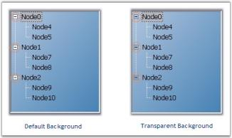
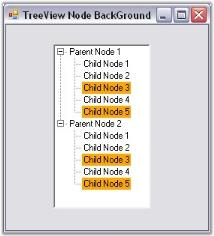
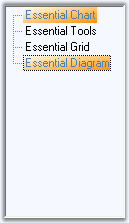
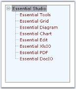
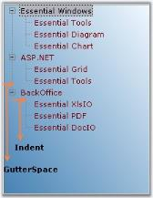

# TreeView Appearance in WinForms TreeView(SfTreeView)

This section provides options to the customize the tree structure and the nodes.

## Background Settings

[WinForms TreeView](https://www.syncfusion.com/winforms-ui-controls/treeview) control lets you customize its background with colors and image.

### Background Colors

The below properties sets the background color for the treeview and also the node text.

Property Table

<table>
<tr>
<th>
TreeViewAdv Properties</th><th>
Description</th></tr>
<tr>
<td>
BackgroundColor</td><td>
Indicates the background color of the control. It provides options to set style, back color, fore color, gradient color and gradient styles.</td></tr>
<tr>
<td>
BackColor</td><td>
Indicates the background color of the text and the graphics of the control.</td></tr>
</table>

N> The Background property is available for individual nodes also.

### Background Image

Use the BackgroundImage property to specify a custom image as the background of the chart. The image layout can also be specified using the properties below.

Property Table

<table>
<tr>
<th>
TreeViewAdv Properties</th><th>
Description</th></tr>
<tr>
<td>
BackgroundImage</td><td>
Indicates the background image that can be used for the control.</td></tr>
<tr>
<td>
BackgroundImageLayout</td><td>
Indicates the layout for the background image in the control.</td></tr>
</table>

## More Customization for PlusMinus Controls

The controls in the TreeViewAdv like PlusMinus control will have a transparent background, if the TransparentControls property is set to true.

Property Table

<table>
<tr>
<th>
TreeViewAdv Properties</th><th>
Description</th></tr>
<tr>
<td>
TransparentControls</td><td>
Indicates if the control will have a transparent background.</td></tr>
</table>




this.treeViewAdv1.TransparentControls = true;





Me.treeViewAdv1.TransparentControls = True




### Themed TreeView Control

Themes can be enabled for the control by enabling ThemesEnabled property. This can also be enabled for individual nodes also by using the TreeNodeAdv.ThemesEnabled property.

Property Table

<table>
<tr>
<th>
TreeViewAdv Properties</th><th>
Description</th></tr>
<tr>
<td>
ThemesEnabled</td><td>
Indicates if the control is drawn themed.</td></tr>
</table>

Property Table

<table>
<tr>
<th>
TreeNodeAdv Properties</th><th>
Description</th></tr>
<tr>
<td>
ThemesEnabled</td><td>
Indicates if the node control will be themed.</td></tr>
</table>

## Drawing Node Background

To draw the node's background, users need to turn on OwnerDrawnNodesBackground property, in theTreeViewAdv and then listen to the tree's NodeBackgroundPaint event which will be called for each node. This can be implemented by using the following code snippet.

Property Table

<table>
<tr>
<th>
TreeViewAdv Properties</th><th>
Description</th></tr>
<tr>
<td>
OwnerDrawnNodesBackground</td><td>
Indicates if the NodeBackgroundPaint event will be fired before drawing a node's background.</td></tr>
</table>

Event Table

<table>
<tr>
<th>
TreeViewAdv event</th><th>
Description</th></tr>
<tr>
<td>
NodeBackgroundPaint</td><td>
This event when fired, paints the background of the node, when OwnerDrawNodes property is set to true.</td></tr>
</table>




this.treeViewAdv1.OwnerDrawNodesBackground = true;

// Background Paint Event
private void treeViewAdv1_NodeBackgroundPaint(object sender, TreeNodeAdvPaintBackgroundEventArgs e)
{
    if (e.Node.Index == 2 | e.Node.Index == 4)
    {
        Syncfusion.Drawing.BrushInfo br = new Syncfusion.Drawing.BrushInfo(Color.Orange);
        e.BrushInfo = br;
    }
}





Me.treeViewAdv1.OwnerDrawNodesBackground = True

' Background Pain Event
Private Sub treeViewAdv1_NodeBackgroundPaint(ByVal sender As Object, ByVal e As TreeNodeAdvPaintBackgroundEventArgs)
    If e.Node.Index = 2 Or e.Node.Index = 4 Then
Dim br As Syncfusion.Drawing.BrushInfo = New Syncfusion.Drawing.BrushInfo(Color.Orange)
e.BrushInfo = br
    End If
End Sub




## Painting the Active and Inactive Nodes

Background for the selected node can be set using SelectedNodeBackground property. The selection rectangle gets grayed out when the TreeViewAdv loses focus. If the user still wishes to maintain the node's active colors, then the InactiveSelectedNodeBackground and InactiveSelectedNodeForeColor properties can be set. 

N> HideSelection property should be set to false to effect this setting.

<table>
<tr>
<th>
TreeViewAdv Properties</th><th>
Description</th></tr>
<tr>
<td>
SelectedNodeBackground</td><td>
Paints the background of the selected node.</td></tr>
<tr>
<td>
InactiveSelectedNodeBackground</td><td>
Indicates the background of the selected node when the control is not focused.</td></tr>
<tr>
<td>
InactiveSelectedNodeForeColor</td><td>
Indicates the text color of the selected node when not focused.</td></tr>
</table>




this.treeViewAdv1.InactiveSelectedNodeBackground = new Syncfusion.Drawing.BrushInfo(Syncfusion.Drawing.GradientStyle.ForwardDiagonal, System.Drawing.Color.Ivory, System.Drawing.Color.DarkOrange);
this.treeViewAdv1.InactiveSelectedNodeForeColor = System.Drawing.Color.SteelBlue;





Me.treeViewAdv1.InactiveSelectedNodeBackground = New Syncfusion.Drawing.BrushInfo(Syncfusion.Drawing.GradientStyle.ForwardDiagonal, System.Drawing.Color.Ivory, System.Drawing.Color.DarkOrange)
Me.treeViewAdv1.InactiveSelectedNodeForeColor = System.Drawing.Color.SteelBlue




## Foreground Settings

Foreground Settings for the tree node text

Using the Text and TextColor property, individual node's text can be edited and colored respectively.

Using the Font and the ForeColor properties of the control, the text and text color of the nodes can be set for all the nodes in the TreeView control.

N> The font style for individual nodes, can be set using the Font property available for individual nodes using NodeCollection Editor.

<table>
<tr>
<th>
TreeViewAdv Properties</th><th>
Description</th></tr>
<tr>
<td>
Font</td><td>
Specifies the Font style of the node text.</td></tr>
<tr>
<td>
ForeColor</td><td>
Specifies the text color of the nodes.</td></tr>
</table>

Property Table

<table>
<tr>
<th>
TreeViewAdv Properties</th><th>
Description</th></tr>
<tr>
<td>
Text</td><td>
Sets text for the node.</td></tr>
<tr>
<td>
TextColor</td><td>
Sets the color for the specific node text.</td></tr>
</table>

N> When you set the ForeColor property for TreeViewAdv control, it will get reflected in the Node's TextColor property. User can change the color for specific nodes using TreeNodeAdv.TextColor property.

## Drawing Selected Node Foreground

Painting the foreground of the Specified Nodes

User can paint specific nodes using the BeforeNodePaint event.

Event Table

<table>
<tr>
<th>
TreeNodeAdv event</th><th>
Description</th></tr>
<tr>
<td>
BeforeNodePaint</td><td>
Handled before a node is being painted.</td></tr>
</table>

N> OwnerDrawNodes property should be set to true while handling this event.

<table>
<tr>
<th>
treeViewAdv Properties</th><th>
Description</th></tr>
<tr>
<td>
OwnerDrawNodes</td><td>
Indicates if the BeforeNodePaint event will be fired before drawing a node.</td></tr>
</table>




this.treeViewAdv1.OwnerDrawNodes = true;

// Enabling Node's Foreground
private void treeViewAdv1_BeforeNodePaint(object sender, TreeNodeAdvPaintEventArgs e)
{
    if (e.Node.Index == 2 | e.Node.Index == 4)
    {
        e.ForeColor=Color.Red;
    }
}





Me.treeViewAdv1.OwnerDrawNodes = True

' Enabling Node's Foreground
Private Sub treeViewAdv1_BeforeNodePaint(ByVal sender As Object, ByVal e As TreeNodeAdvPaintEventArgs)
If e.Node.Index = 2 Or e.Node.Index = 4 Then
e.ForeColor = Color.Red
End If
End Sub




Active Node Foreground Settings

SelectedNodeForeColor property lets you paint the selected node.

Property Table

<table>
<tr>
<th>
treeViewAdv Properties</th><th>
Description</th></tr>
<tr>
<td>
SelectedNodeForeColor</td><td>
Indicates the fore color of the node that is selected.</td></tr>
</table>




this.treeViewAdv1.SelectedNodeForeColor = System.Drawing.Color.Gray;





Me.treeViewAdv1.SelectedNodeForeColor = System.Drawing.Color.Gray




Post Default Drawing

Users can also draw on the node, after the default drawing routines have rendered the node appropriately. Users can do so by first turning on OwnerDrawnNodes in the tree and listening to the AfterNodePaint event.

Event Table

<table>
<tr>
<th>
TooltipTreeNodeAdv event</th><th>
Description</th></tr>
<tr>
<td>
AfterNodePaint</td><td>
Handled after a node is painted.</td></tr>
</table>



Image Overlaying



## Border Settings

3D Border for TreeView 

The following properties sets 3D border for the treeview.

Property Table

<table>
<tr>
<th>
TreeViewAdv Property</th><th>
Description</th></tr>
<tr>
<td>
BorderStyle</td><td>
Sets the border style for the Treeview control.{{ '_FixedSingle_' | markdownify }} - a normal border,{{ '_Fixed3D_' | markdownify }} - 3D appearance.</td></tr>
<tr>
<td>
Border3DStyle</td><td>
Indicates the style of the 3D border when BorderStyle is set to Fixed3D.RaisedOuter SunkenOuterRaisedInnerSunkenInnerRaisedEtchedBumpSunken (Default)Adjust Flat</td></tr>
</table>

## 2D Border for TreeView

The following properties let you set customized 2D border.

N> The settings will effect only when TreeViewAdv.BorderStyle property is set to FixedSingle.

<table>
<tr>
<th>
TreeViewAdv Property</th><th>
Description</th></tr>
<tr>
<td>
BorderColor</td><td>
Indicates the color of the 2D border.</td></tr>
<tr>
<td>
BorderSides</td><td>
Specifies the sides of the control to which border should be set.</td></tr>
<tr>
<td>
BorderSingle</td><td>
Indicates the 2D border style. The options are,Solid (Default),Dotted,Dashed,Inset,Outset,None.</td></tr>
</table>




this.treeViewAdv1.BorderColor = System.Drawing.Color.SteelBlue;
this.treeViewAdv1.BorderSingle = System.Windows.Forms.ButtonBorderStyle.Dashed;
this.treeViewAdv1.BorderStyle = System.Windows.Forms.BorderStyle.FixedSingle;





Me.treeViewAdv1.BorderColor = System.Drawing.Color.SteelBlue
Me.treeViewAdv1.BorderSingle = System.Windows.Forms.ButtonBorderStyle.Dashed
Me.treeViewAdv1.BorderStyle = System.Windows.Forms.BorderStyle.FixedSingle




## Spacing

TreeViewAdv architecture gives a neat look by using the gutter space and indentation features.

GutterSpace

The space on the left side of a TreeViewAdv control is the gutter space which acts as a left margin to the control. It can be modified using GutterSpace property. By default it is 3.




this.treeViewAdv1.GutterSpace = 7;



 

Me.treeViewAdv1.GutterSpace = 5




Indentation

The space between the parent node and the child node is the Indentation. It indicates the indent of the child nodes from the parent node. By providing value to the Indent property of the TreeViewAdv control, Indentation can be altered. Default value is 19.




this.treeViewAdv1.Indent = 21





Me.treeViewAdv1.Indent = 21




## Visual Style

VisualStyles provides rich and professional look and feel UI for the TreeViewAdv control. Some of the available VisualStyles are as follows:

* Default
* Office2007
* Office2010
* Metro
* Office2016Colorful
* Office2016White
* Office2016Black
* Office2016DarkGray

The visual style can be applied for the TreeViewAdv using `Style` property.





//Set the visual Style of the TreeViewAdv control.
this.treeViewAdv1.Style = Syncfusion.Windows.Forms.Tools.TreeStyle.Office2016Colorful;





'Set the visual Style of the TreeViewAdv control.
Me.treeViewAdv1.Style = Syncfusion.Windows.Forms.Tools.TreeStyle.Office2016Colorful
 




