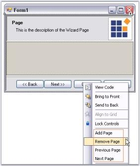
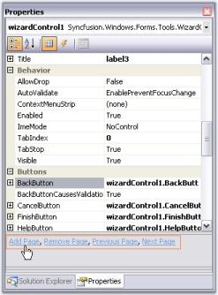

# DesignTime features

The below topics are discussed in this particular section.

## Options to add page, remove page, previous page, and next page

This section will guide you with various options available in the designer to add page, remove page, go to previous page and next page.

### Using property grid

### Using smart tag

### Using context menu

### Property grid commands

### Page selection at design time

This section will guide you with page selection options at design time.

* We can easily navigate between the Wizard pages using the Next and Back buttons in the designer. These buttons are selectable at design time.

* Another way to navigate is to access the Next Page or Previous Page option in the context menu or Smart Tag of the Wizard control.
* See Options to Add Page, Remove Page, Previous page and Next Page topic, to see the Next page and Previous page options in smart tag and context menu.
* You can also do the page selection using SelectedWizardPage or CardLayout property.

