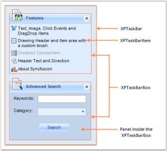

# About Syncfusion® Windows Forms XPTaskBar Control

The various sections of XPTaskBar and their descriptions are given below.

## XPTaskBar

It represents a Windows XP like task menu panel.

## XPTaskBar box

This is the area in which the XPTaskBar Items are displayed.

## XPTaskBar items

XPTaskBar Items can be used to display text and images.

The appearance of the XPTaskBar Items can be customized using the various properties provided in the XPTaskBarItem Collection Editor.

