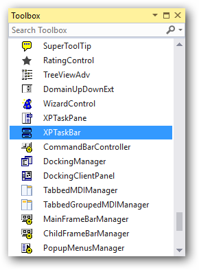
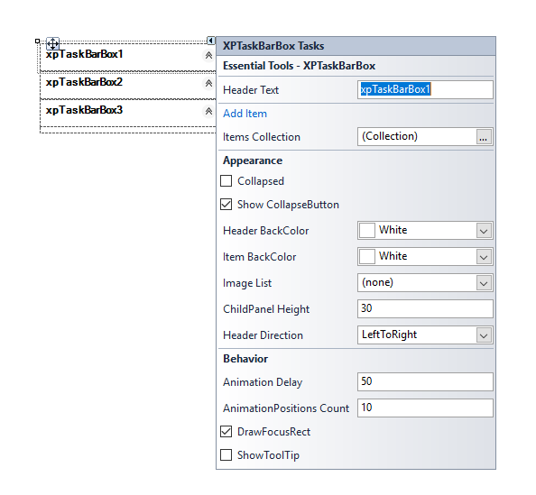
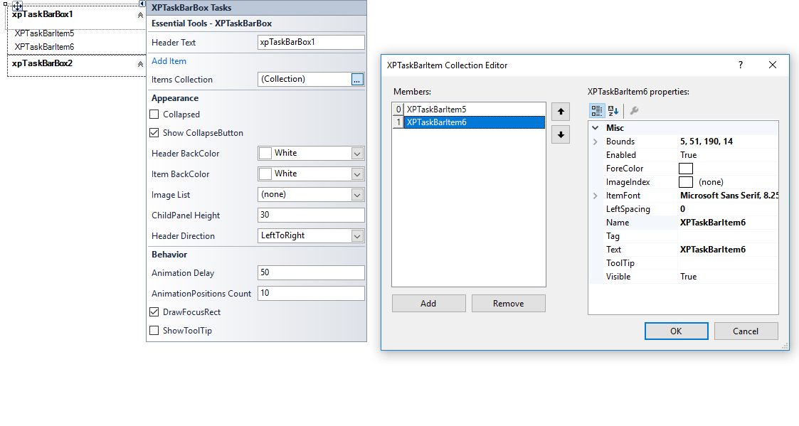
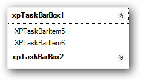

# Getting Started in Windows Forms xp taskbar (XPTaskBar)

This section describes how to add `XPTaskBar` control in a Windows Forms application and overview of its basic functionalities.

## Assembly deployment

Refer [control dependencies](https://help.syncfusion.com/windowsforms/control-dependencies#xptaskbar) section to get the list of assemblies or NuGet package needs to be added as reference to use the control in any application.
 
Please find more details regarding how to install the nuget packages in windows form application in the below link:
 
[How to install nuget packages](https://help.syncfusion.com/windowsforms/installation/install-nuget-packages)

## Creating simple application with XPTaskBar

You can create the Windows Forms application with XPTaskBar control as follows:

1. [Creating project](#creating-the-project)
2. [Adding control via designer](#adding-control-via-designer)
3. [Adding control manually using code](#adding-control-manually-using-code)

### Creating the project

Create a new Windows Forms project in the Visual Studio to display the XPTaskBar with  functionalities.

## Adding control via designer

The XPTaskBar control can be added to the application by dragging it from the toolbox and dropping it in a designer view. The following required assembly references will be added automatically:

* Syncfusion.Grid.Base.dll
* Syncfusion.Grid.Windows.dll
* Syncfusion.Shared.Base.dll
* Syncfusion.Shared.Windows.dll
* Syncfusion.Tools.Base.dll
* Syncfusion.Tools.Windows.dll

**Adding XPTaskBarBox**

To add XPTaskBarBox, click on `Add TaskBarBox` in Smart Tag of XPTaskBar in design view.

**Adding XPTaskBarItems**

XPTaskBarItems can be added to XPTaskBarBox using `Items` collection, in Smart Tag of XPTaskBarBox in design view.

## Adding control manually using code

To add control manually in C#, follow the given steps:

**Step 1** - Add the following required assembly references to the project:

        * Syncfusion.Grid.Base.dll
        * Syncfusion.Grid.Windows.dll
        * Syncfusion.Shared.Base.dll
        * Syncfusion.Shared.Windows.dll
        * Syncfusion.Tools.Base.dll
        * Syncfusion.Tools.Windows.dll

**Step 2** -Include the namespaces **Syncfusion.Windows.Forms.Tools**.

​




using Syncfusion.Windows.Forms.Tools;





Imports Syncfusion.Windows.Forms.Tools



 

{{ codesnippet1 | OrderList_Indent_Level_1 }}

**Step 3** - Create `XPTaskBar` control instance and add it to the form.

​




XPTaskBar xpTaskBar1 = new XPTaskBar();

this.Controls.Add(xpTaskBar1);





Dim xpTaskBar1 As XPTaskBar = New XPTaskBar()

Me.Controls.Add(xpTaskBar1)





{{ codesnippet2 | OrderList_Indent_Level_1 }}

**Adding XPTaskBarBox**

Create an instance for `XPTaskBarBox` class and add it to XPTaskBar's controls collection.





XPTaskBarBox xpTaskBarBox1 = new XPTaskBarBox();
XPTaskBarBox xpTaskBarBox2 = new XPTaskBarBox();
XPTaskBarBox xpTaskBarBox3 = new XPTaskBarBox();

this.xpTaskBarBox1.Text = "xpTaskBarBox1";
this.xpTaskBarBox2.Text = "xpTaskBarBox2";
this.xpTaskBarBox3.Text = "xpTaskBarBox3";

this.xpTaskBar1.Controls.Add(this.xpTaskBarBox1);
this.xpTaskBar2.Controls.Add(this.xpTaskBarBox2);
this.xpTaskBar3.Controls.Add(this.xpTaskBarBox3);





Dim xpTaskBarBox1 As XPTaskBarBox = New XPTaskBarBox()
Dim xpTaskBarBox2 As XPTaskBarBox = New XPTaskBarBox()
Dim xpTaskBarBox3 As XPTaskBarBox = New XPTaskBarBox()

Me.xpTaskBarBox1.Text = "xpTaskBarBox1"
Me.xpTaskBarBox2.Text = "xpTaskBarBox2"
Me.xpTaskBarBox3.Text = "xpTaskBarBox3"

Me.xpTaskBar1.Controls.Add(Me.xpTaskBarBox1)
Me.xpTaskBar2.Controls.Add(Me.xpTaskBarBox2)
Me.xpTaskBar3.Controls.Add(Me.xpTaskBarBox3)





**Adding XPTaskBarItems**

XPTaskBarItems can be added to XPTaskBarBox using `Items` collection in XPTaskBarBox class.





this.xpTaskBarBox1.Items.AddRange(new Syncfusion.Windows.Forms.Tools.XPTaskBarItem[] {
            new Syncfusion.Windows.Forms.Tools.XPTaskBarItem("XPTaskBarItem5", System.Drawing.Color.Empty, -1, "XPTaskBarItem5"),
            new Syncfusion.Windows.Forms.Tools.XPTaskBarItem("XPTaskBarItem6", System.Drawing.Color.Empty, -1, "XPTaskBarItem6")});





Me.xpTaskBarBox1.Items.AddRange(New Syncfusion.Windows.Forms.Tools.XPTaskBarItem[] {
            New Syncfusion.Windows.Forms.Tools.XPTaskBarItem("XPTaskBarItem5", System.Drawing.Color.Empty, -1, "XPTaskBarItem5"),
            New Syncfusion.Windows.Forms.Tools.XPTaskBarItem("XPTaskBarItem6", System.Drawing.Color.Empty, -1, "XPTaskBarItem6")})





