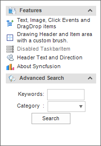

# Windows Forms xp taskbar (XPTaskBar) Overview

[XPTaskBar](https://help.syncfusion.com/cr/windowsforms/Syncfusion.Windows.Forms.Tools.XPTaskBar.html) represents a Windows XP like task menu panel. It helps display a set of command items ([XPTaskBarItem](https://help.syncfusion.com/cr/windowsforms/Syncfusion.Windows.Forms.Tools.XPTaskBarItem.html)) or frequently used features (like "Search", "Advanced Search", etc) in panels, that can be classified, contained and displayed within one or more command boxes ([XPTaskBarBox](https://help.syncfusion.com/cr/windowsforms/Syncfusion.Windows.Forms.Tools.XPTaskBarBox.html)). 

 

## Key features

    .Header settings- Provides options to customize the text, appearance, font and size of the XPTaskBarBox header.

    .Layout orientation- Provides options to customize the layout to be horizontal or vertical.

    .Padding- Provides options to customize interior spacing, horizontal and vertical padding using integer values.

    .Visual style- Provides rich set of style to customize the look and feel of XPTaskBar.
