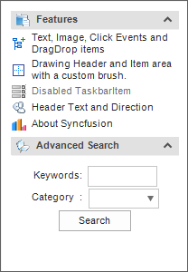

# About Syncfusion® Windows Forms XPTaskBar Control

[XPTaskBar](https://help.syncfusion.com/cr/windowsforms/Syncfusion.Windows.Forms.Tools.XPTaskBar.html) represents a Windows XP like task menu panel. It helps display a set of command items ([XPTaskBarItem](https://help.syncfusion.com/cr/windowsforms/Syncfusion.Windows.Forms.Tools.XPTaskBarItem.html)) or frequently used features (like "Search", "Advanced Search", etc) in panels, that can be classified, contained and displayed within one or more command boxes ([XPTaskBarBox](https://help.syncfusion.com/cr/windowsforms/Syncfusion.Windows.Forms.Tools.XPTaskBarBox.html)). 

 

## Key features

* **Header settings** - Provides options to customize the text, appearance, font and size of the XPTaskBarBox header. For more details, refer to the [XPTaskBarBox Settings](https://help.syncfusion.com/windowsforms/xptaskbar/xptaskbar-box-settings) documentation.

* **Layout orientation** - Provides options to customize the layout to be horizontal or vertical. For more details, refer to the [XPTaskBar Settings](https://help.syncfusion.com/windowsforms/xptaskbar/xptaskbar-settings) documentation.

* **Padding** - Provides options to customize interior spacing, horizontal and vertical padding using integer values. For more details, refer to the [Padding](https://help.syncfusion.com/windowsforms/xptaskbar/padding) documentation.

* **Visual style** - Provides rich set of style to customize the look and feel of XPTaskBar. For more details, refer to the [Visual Style](https://help.syncfusion.com/windowsforms/xptaskbar/visual-style) documentation.

## See also

* [Getting Started](https://help.syncfusion.com/windowsforms/xptaskbar/creating-an-xptaskbar)
* [Events](https://help.syncfusion.com/windowsforms/xptaskbar/xptaskbar-events)
* [Image Settings](https://help.syncfusion.com/windowsforms/xptaskbar/xptaskbar-image-settings)
