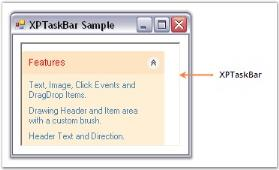
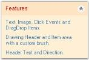

---
layout: post
title: Padding in Windows Forms XPTaskBar | Syncfusion®
description: Padding settings enable configuring spacing for XPTaskBar layouts and task box headers to improve content presentation.
platform: windowsforms
control: XPTaskBar
documentation: ug
--- 
# Padding in Windows Forms XPTaskBar

The XPTaskBar control is assumed to be created as shown in the [Getting Started](https://help.syncfusion.com/windowsforms/xptaskbar/creating-an-xptaskbar) documentation before trying the below code.

## Padding settings for XPTaskBar

The interior spacing of the XPTaskBar control can be specified by setting the DockPadding property to integer values.

The horizontal and vertical padding can be specified using the [HorizontalPadding](https://help.syncfusion.com/cr/windowsforms/Syncfusion.Windows.Forms.Tools.XPTaskBar.html#Syncfusion_Windows_Forms_Tools_XPTaskBar_HorizontalPadding) and [VerticalPadding](https://help.syncfusion.com/cr/windowsforms/Syncfusion.Windows.Forms.Tools.XPTaskBar.html#Syncfusion_Windows_Forms_Tools_XPTaskBar_VerticalPadding) properties. The default value of both is zero (in pixels).



this.xpTaskBar1.DockPadding.All = 10;
this.xpTaskBar1.HorizontalPadding = 3;
this.xpTaskBar1.VerticalPadding = 3;


Me.xpTaskBar1.DockPadding.All = 10
Me.xpTaskBar1.HorizontalPadding = 3
Me.xpTaskBar1.VerticalPadding = 3



 

### Padding settings for XPTaskBar box header

Padding provides spacing between the text of the header and its borders. Horizontal and vertical padding can be set using the [PADX](https://help.syncfusion.com/cr/windowsforms/Syncfusion.Windows.Forms.Tools.XPTaskBarBox.html#Syncfusion_Windows_Forms_Tools_XPTaskBarBox_PADX) and [PADY](https://help.syncfusion.com/cr/windowsforms/Syncfusion.Windows.Forms.Tools.XPTaskBarBox.html#Syncfusion_Windows_Forms_Tools_XPTaskBarBox_PADY) properties. Values are in pixels.


  
this.xpTaskBarBox1.PADX = 7;
this.xpTaskBarBox1.PADY = 7;


Me.xpTaskBarBox1.PADX = 7
Me.xpTaskBarBox1.PADY = 7



The following figure displays the XPTaskBar Box with padding settings.

