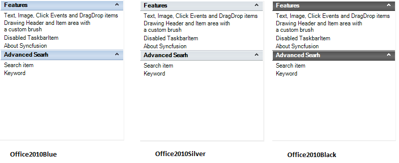
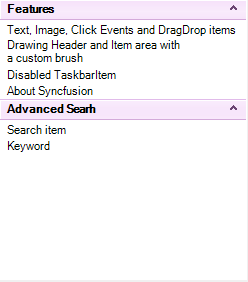
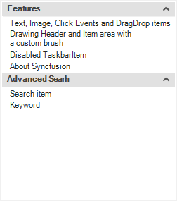
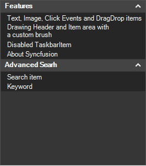

# Visual Style in Windows Forms xp taskbar (XPTaskBar)

 XPTaskBar offers various built in themes for its professional representation as follows

    •	Default

    •	Office2007

    •	Office2010

    •	Metro

    •	Office2016Colorful

    •	Office2016White

    •	Office2016DarkGray

    •	Office2016Black

You can set the above themes using the [Style](https://help.syncfusion.com/cr/windowsforms/Syncfusion.Windows.Forms.Tools.XPTaskBar.html#Syncfusion_Windows_Forms_Tools_XPTaskBar_Style) property.

**Default**

This option helps to set the Default appearance.



 

//Default

this.xpTaskBar1.Style = Syncfusion.Windows.Forms.Tools.XPTaskBarStyle.Default;

 

 

'Default

Me.xpTaskBar1.Style = Syncfusion.Windows.Forms.Tools.XPTaskBarStyle.Default





 

**Office2007**

This option helps to set the Office2007 appearance.



 

this.xpTaskBar1.Style = Syncfusion.Windows.Forms.Tools.XPTaskBarStyle.Office2007;

//Sets the Blue Color Scheme

this.xpTaskBar1.Office2007ColorScheme = Syncfusion.Windows.Forms.Office2007Theme.Blue;

//Sets the Silver Color Scheme

this.xpTaskBar1.Office2007ColorScheme = Syncfusion.Windows.Forms.Office2007Theme.Silver;

//Sets the Black Color Scheme

this.xpTaskBar1.Office2007ColorScheme = Syncfusion.Windows.Forms.Office2007Theme.Black;

 

 

Me.xpTaskBar1.Style = Syncfusion.Windows.Forms.Tools.XPTaskBarStyle.Office2007

'Sets the Blue Color Scheme

Me.xpTaskBar1.Office2007ColorScheme = Syncfusion.Windows.Forms.Office2007Theme.Blue

'Sets the Silver Color Scheme

Me.xpTaskBar1.Office2007ColorScheme = Syncfusion.Windows.Forms.Office2007Theme.Silver

'Sets the Black Color Scheme

Me.xpTaskBar1.Office2007ColorScheme = Syncfusion.Windows.Forms.Office2007Theme.Black





 

**Custom colors**

We can also apply custom colors to the XPTaskBar control by setting Office2007ColorScheme to "_Managed_", and specifying the 
custom color through the ApplyManagedColors method as follows.



  

this.xpTaskBar1.Office2007ColorScheme = Syncfusion.Windows.Forms.Office2007Theme.Managed;

Office2007Colors.ApplyManagedColors(this, Color.DarkGreen);



 

Me.xpTaskBar1.Office2007ColorScheme = Syncfusion.Windows.Forms.Office2007Theme.Managed

Office2007Colors.ApplyManagedColors(Me, Color.DarkGreen)





 

**Office2010**

 This option helps to set the Office2010 appearance.



 

this.xpTaskBar1.Style = Syncfusion.Windows.Forms.Tools.XPTaskBarStyle.Office2010;

//Sets the Blue Color Scheme

this.xpTaskBar1.Office2010ColorScheme = Syncfusion.Windows.Forms.Office2010Theme.Blue;

//Sets the Silver Color Scheme

this.xpTaskBar1.Office2010ColorScheme = Syncfusion.Windows.Forms.Office2010Theme.Silver;

//Sets the Black Color Scheme

this.xpTaskBar1.Office2010ColorScheme = Syncfusion.Windows.Forms.Office2010Theme.Black;

 

 

Me.xpTaskBar1.Style = Syncfusion.Windows.Forms.Tools.XPTaskBarStyle.Office2010

'Sets the Blue Color Scheme

this.xpTaskBar1.Office2010ColorScheme = Syncfusion.Windows.Forms.Office2010Theme.Blue

'Sets the Silver Color Scheme

this.xpTaskBar1.Office2010ColorScheme = Syncfusion.Windows.Forms.Office2010Theme.Silver

'Sets the Black Color Scheme

this.xpTaskBar1.Office2010ColorScheme = Syncfusion.Windows.Forms.Office2010Theme.Black





 

**Custom colors**

We can also apply custom colors to the XPTaskBar control by setting Office2010ColorScheme to "_Managed_", and specifying the custom color through the ApplyManagedColors method as follows.



  

this.xpTaskBar1.Office2010ColorScheme = Syncfusion.Windows.Forms.Office2010Theme.Managed;

Office2010Colors.ApplyManagedColors(this, Color.Violet);



 

Me.xpTaskBar1.Office2010ColorScheme = Syncfusion.Windows.Forms.Office2010Theme.Managed

Office2010Colors.ApplyManagedColors(this, Color.Violet)





 

**Metro**

This options helps to set the Metro appearance.
 


 

//Metro

this.xpTaskBar1.Style = Syncfusion.Windows.Forms.Tools.XPTaskBarStyle.Metro;

 

 

'Metro

Me.xpTaskBar1.Style = Syncfusion.Windows.Forms.Tools.XPTaskBarStyle.Metro





**Office2016Colorful**

This options helps to set the Office2016Colorful appearance.
 


 

//Office2016Colorful

this.xpTaskBar1.Style = Syncfusion.Windows.Forms.XPTaskBarStyle.Office2016Colorful;

 

 

'Office2016Colorful

Me.xpTaskBar1.Style = Syncfusion.Windows.Forms.Tools.XPTaskBarStyle.Office2016Colorful





 

**Office2016White**

This options helps to set the Office2016White appearance.
 


 

//Office2016White

this.xpTaskBar1.Style = Syncfusion.Windows.Forms.XPTaskBarStyle.Office2016White;

 

 

'Office2016White

Me.xpTaskBar1.Style = Syncfusion.Windows.Forms.Tools.XPTaskBarStyle.Office2016White





**Office2016DarkGray**

This options helps to set the Office2016DarkGray appearance.
 


 

//Office2016DarkGray

this.xpTaskBar1.Style = Syncfusion.Windows.Forms.XPTaskBarStyle.Office2016DarkGray;

 

 

'Office2016DarkGray

Me.xpTaskBar1.Style = Syncfusion.Windows.Forms.Tools.XPTaskBarStyle.Office2016DarkGray





**Office2016Black**

This options helps to set the Office2016Black appearance.
 


 

//Office2016Black

this.xpTaskBar1.Style = Syncfusion.Windows.Forms.XPTaskBarStyle.Office2016Black;

 

 

'Office2016Black

Me.xpTaskBar1.Style = Syncfusion.Windows.Forms.Tools.XPTaskBarStyle.Office2016Black





 

