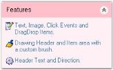

# XPTaskBar Image Settings in Windows Forms xp taskbar (XPTaskBar)

This section discusses the image settings available in XPTaskBar.

## Adding images to the XPTaskBar box header

We can add images to the header of the XPTaskBar Box using the [ImageList](https://help.syncfusion.com/cr/windowsforms/Syncfusion.Windows.Forms.Tools.XPTaskBarBox.html#Syncfusion_Windows_Forms_Tools_XPTaskBarBox_ImageList) control and some properties that are discussed below.

* [HeaderImageList](https://help.syncfusion.com/cr/windowsforms/Syncfusion.Windows.Forms.Tools.XPTaskBarBox.html#Syncfusion_Windows_Forms_Tools_XPTaskBarBox_HeaderImageList)
* [HeaderImageIndex](https://help.syncfusion.com/cr/windowsforms/Syncfusion.Windows.Forms.Tools.XPTaskBarBox.html#Syncfusion_Windows_Forms_Tools_XPTaskBarBox_HeaderImageIndex)

Drag and drop the ImageList control onto the form and add images to it using the Image Collection Editor. To include an image in the header, set the [HeaderImageList](https://help.syncfusion.com/cr/windowsforms/Syncfusion.Windows.Forms.Tools.XPTaskBarBox.html#Syncfusion_Windows_Forms_Tools_XPTaskBarBox_HeaderImageList) property to an ImageList containing the image and also set the [HeaderImageIndex](https://help.syncfusion.com/cr/windowsforms/Syncfusion.Windows.Forms.Tools.XPTaskBarBox.html#Syncfusion_Windows_Forms_Tools_XPTaskBarBox_HeaderImageIndex) property to refer to a specific image within the above list.



  

this.xpTaskBarBox1.ImageList = this.imageList1;

this.xpTaskBarBox1.HeaderImageList = this.imageList2;

this.xpTaskBarBox1.HeaderImageIndex = 0;





Me.xpTaskBarBox1.ImageList = Me.imageList1

Me.xpTaskBarBox1.HeaderImageList = Me.imageList2

Me.xpTaskBarBox1.HeaderImageIndex = 0





  
Image added to the TaskBar Box Header

## Adding images to XPTaskBar items

Images can be easily associated with the ImageIndex property of the XPTaskBar Items.

* [ImageList](https://help.syncfusion.com/cr/windowsforms/Syncfusion.Windows.Forms.Tools.XPTaskBarBox.html#Syncfusion_Windows_Forms_Tools_XPTaskBarBox_ImageList)
* [ImageIndex](https://help.syncfusion.com/cr/windowsforms/Syncfusion.Windows.Forms.Tools.XPTaskBarItem.html#Syncfusion_Windows_Forms_Tools_XPTaskBarItem_ImageIndex)

The ImageIndex of the XPTaskBar Items can be specified in the XPTaskBarItem Collection Editor.





this.xpTaskBarBox1.ImageList = this.imageList1;

this.xpTaskBarBox1.Items[0].ImageIndex = 0;

this.xpTaskBarBox1.Items[1].ImageIndex = 1;

this.xpTaskBarBox1.Items[2].ImageIndex = 2;



 

Me.xpTaskBarBox1.ImageList = Me.imageList1

Me.xpTaskBarBox1.Items(0)ImageIndex = 0

Me.xpTaskBarBox1.Items(1)ImageIndex = 1

Me.xpTaskBarBox1.Items(2)ImageIndex = 2





 
