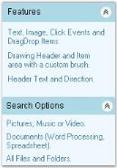
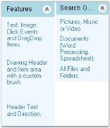
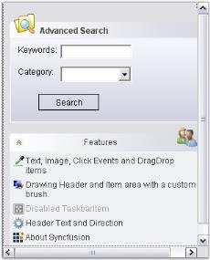

---
layout: post
title: Configure XPTaskBar Settings in Windows Forms XPTaskBar | Syncfusion®
description: XPTaskBar settings support layout management, scrolling behavior, drag-and-drop functionality, and state persistence.
platform: windowsforms
control: XPTaskBar
documentation: ug
---
# Configure XPTaskBar Settings in Windows Forms XPTaskBar

The behavior of the XPTaskBar can be controlled using the properties given below.

## Behavior settings

This section discusses the behavior settings of the XPTaskBar.

* [AllowDrop](https://learn.microsoft.com/en-us/dotnet/api/system.windows.forms.control.allowdrop) - Enables drag-and-drop on the XPTaskBar control.
* [AutoPersistStates](https://help.syncfusion.com/cr/windowsforms/Syncfusion.Windows.Forms.Tools.XPTaskBar.html#Syncfusion_Windows_Forms_Tools_XPTaskBar_AutoPersistStates) - Persists the collapsed/expanded states of the XPTaskBarBoxes. Persisting states requires the `AppStateSerializer` configuration.
* [VerticalLayout](https://help.syncfusion.com/cr/windowsforms/Syncfusion.Windows.Forms.Tools.XPTaskBar.html#Syncfusion_Windows_Forms_Tools_XPTaskBar_VerticalLayout) - Arranges the XPTaskBarBoxes vertically (default) or horizontally.
* [ColWidthOnHorizontalAlignment](https://help.syncfusion.com/cr/windowsforms/Syncfusion.Windows.Forms.Tools.XPTaskBar.html#Syncfusion_Windows_Forms_Tools_XPTaskBar_ColWidthOnHorizontalAlignment) - Specifies the column width of the XPTaskBarBoxes in the horizontal layout mode.



  

this.xpTaskBar1.AllowDrop = true;

this.xpTaskBar1.AutoPersistStates = true;

this.xpTaskBar1.ColWidthOnHorizontalAlignment = 100;

this.xpTaskBar1.VerticalLayout = true;



 

Me.xpTaskBar1.AllowDrop = True

Me.xpTaskBar1.AutoPersistStates = True

Me.xpTaskBar1.ColWidthOnHorizontalAlignment = 100

Me.xpTaskBar1.VerticalLayout = True





 

## Scroll settings

Vertical scrollbar will be automatically added to the XPTaskBar when the TaskBar Boxes are placed outside the TaskBar's client area, provided the XPTaskBar is in the Vertical Layout mode.

In the Horizontal Layout mode, the horizontal scrollbar appears on setting the [ColWidthOnHorizontalAlignment](https://help.syncfusion.com/cr/windowsforms/Syncfusion.Windows.Forms.Tools.XPTaskBar.html#Syncfusion_Windows_Forms_Tools_XPTaskBar_ColWidthOnHorizontalAlignment) property to large values.

* [AutoScroll](https://learn.microsoft.com/en-us/dotnet/api/system.windows.forms.scrollablecontrol.autoscroll)
* [AutoScrollMargin](https://learn.microsoft.com/en-us/dotnet/api/system.windows.forms.scrollablecontrol.autoscrollmargin)
* [AutoScrollMinSize](https://learn.microsoft.com/en-us/dotnet/api/system.windows.forms.scrollablecontrol.autoscrollminsize)



  

this.xpTaskBar1.AutoScroll = true;

this.xpTaskBar1.AutoScrollMargin = new System.Drawing.Size(5, 5);

this.xpTaskBar1.AutoScrollMinSize = new System.Drawing.Size(3, 3);



 

Me.xpTaskBar1.AutoScroll = True

Me.xpTaskBar1.AutoScrollMargin = New System.Drawing.Size(5, 5)

Me.xpTaskBar1.AutoScrollMinSize = New System.Drawing.Size(3, 3)





  
