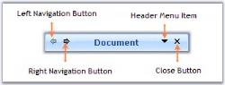
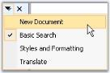

# Header Settings in Windows Forms xp task pane (XPTaskPane)

## Setting visibility of the ToolBar items

The header section by default has four toolbar items. Left and right navigating buttons at the top left corner of the TaskPane Header and DropDownMenu and Close Button at the top right corner of the TaskPane Header.

* HeaderLeftToolbar.Items[0] - Indicates Left navigating button, lets you navigate to the previous page.
* HeaderLeftToolbar.Items[1] - Indicates Right navigating button, lets you navigate to the next page.
* HeaderRightToolbar.Items[0] - Indicates Header Menu Item which lists all the Task pages when clicked at run time.

* HeaderRightToolbar.Items[1] - Indicates Close button, using which we can close the Task Pane.

The visibility of these items can be controlled using the below code snippets.





//Setting the visibility of the left navigating button at the top left corner

this.xpTaskPane1.HeaderLeftToolbar.Items[0].Visible = true;

//Setting the visibility of the Right navigating button at the top left corner

this.xpTaskPane1.HeaderLeftToolbar.Items[1].Visible = true;

//Setting the visibility of the header menu item at the top right corner

this.xpTaskPane1.HeaderRightToolbar.Items[0].Visible = true;

//Setting the visibility of the close button item at the top right corner

this.xpTaskPane1.HeaderRightToolbar.Items[1].Visible = true;





'Setting the visibility of the left navigating button at the top left corner

Me.xpTaskPane1.HeaderLeftToolbar.Items[0].Visible = True

'Setting the visibility of the Right navigating button at the top left corner

Me.xpTaskPane1.HeaderLeftToolbar.Items[1].Visible = True

'Setting the visibility of the header menu item at the top right corner

Me.xpTaskPane1.HeaderRightToolbar.Items[0].Visible = True

'Setting the visibility of the close button item at the top right corner

Me.xpTaskPane1.HeaderRightToolbar.Items[1].Visible = True





### Images for Toolbar items

We can change the existing image for the toolbar items using the below code snippets.





//Setting Image for the right navigating button

this.xpTaskPane1.HeaderLeftToolbar.Items[1].ImageList = this.imageList1;

this.xpTaskPane1.HeaderLeftToolbar.Items[1].ImageIndex = 0;

//Setting Image for the left navigating button

this.xpTaskPane1.HeaderLeftToolbar.Items[0].ImageList = this.imageList1;

this.xpTaskPane1.HeaderLeftToolbar.Items[0].ImageIndex = 1;





'Setting Image for the right navigating button

Me.xpTaskPane1.HeaderLeftToolbar.Items[1].ImageList = Me.imageList1

Me.xpTaskPane1.HeaderLeftToolbar.Items[1].ImageIndex = 0

'Setting Image for the left navigating button

Me.xpTaskPane1.HeaderLeftToolbar.Items[0].ImageList = Me.imageList1

Me.xpTaskPane1.HeaderLeftToolbar.Items[0].ImageIndex = 1





## Customizing header menu item image

The Header Menu Item image can be changed through ImageIndex property which lists a set of pre-defined images, else set the Image property to the custom image you want to set for the drop-down image.

Property table

<table>
<tr>
<th>
Property</th><th>
Description</th></tr>
<tr>
<td>
HeaderMenuItem.ImageIndex</td><td>
Specifies index of the image to be displayed in the DropDownMenu item.</td></tr>
<tr>
<td>
HeaderMenuItem.Image</td><td>
Sets the image to be displayed in DropDownMenu item.</td></tr>
</table>





//Setting Image for the DropDownMenu item

this.xpTaskPane1.HeaderMenuItem.ImageIndex = 1;





'Setting Image for the DropDownMenu item

Me.xpTaskPane1.HeaderMenuItem.ImageIndex = 1





