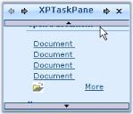

---
layout: post
title: Scroll Settings in Windows Forms XPTaskPane | Syncfusion®
description: Scroll settings enable vertical scrolling, automatic page navigation, and configurable scrolling speed for task pages.
platform: windowsforms
control: Wizard
documentation: ug
---

# Scroll Settings in Windows Forms XPTaskPane

[XPTaskPane](https://help.syncfusion.com/cr/windowsforms/Syncfusion.Windows.Forms.Tools.XPTaskPane.html) Enables vertical scrolling for the pages using [VerticalScroll](https://help.syncfusion.com/cr/windowsforms/Syncfusion.Windows.Forms.Tools.XPTaskPane.html#Syncfusion_Windows_Forms_Tools_XPTaskPane_VerticalScroll) property. On mouse hovering over the scroll bar, the task page automatically moves and show the hidden contents. Scrolling speed can be fixed using [ScrollSpeed](https://help.syncfusion.com/cr/windowsforms/Syncfusion.Windows.Forms.Tools.XPTaskPane.html#Syncfusion_Windows_Forms_Tools_XPTaskPane_ScrollSpeed) property.





this.xpTaskPane1.ScrollSpeed= 20;

this.xpTaskPane1.VerticalScroll = true;





Me.xpTaskPane1.ScrollSpeed = 20

Me.xpTaskPane1.VerticalScroll = True





