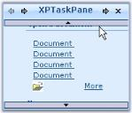

# Scroll Settings in Windows Forms XPTaskPane

[XPTaskPane](https://help.syncfusion.com/cr/windowsforms/Syncfusion.Windows.Forms.Tools.XPTaskPane.html) enables vertical scrolling for the pages using [VerticalScroll](https://help.syncfusion.com/cr/windowsforms/Syncfusion.Windows.Forms.Tools.XPTaskPane.html#Syncfusion_Windows_Forms_Tools_XPTaskPane_VerticalScroll) property. On mouse hovering over the scroll bar, the task page automatically moves and shows the hidden contents. Scrolling speed can be set using [ScrollSpeed](https://help.syncfusion.com/cr/windowsforms/Syncfusion.Windows.Forms.Tools.XPTaskPane.html#Syncfusion_Windows_Forms_Tools_XPTaskPane_ScrollSpeed) property. The default value of `ScrollSpeed` is `10` (in milliseconds) and `VerticalScroll` is `false`.





this.xpTaskPane1.ScrollSpeed = 20;

this.xpTaskPane1.VerticalScroll = true;





Me.xpTaskPane1.ScrollSpeed = 20

Me.xpTaskPane1.VerticalScroll = True





