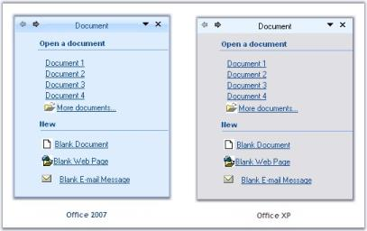
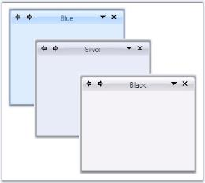
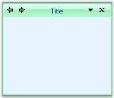

---
layout: post
title: Appearance in Windows Forms XPTaskPane | Syncfusion®
description: XPTaskPane appearance customization supports fonts, colors, visual styles, Office themes, and custom color schemes.
platform: windowsforms
control: XPTaskPane
documentation: ug
---

# Appearance in Windows Forms XPTaskPane

## Foreground settings

### XPTaskPane foreground

Font style and fore color of the Task pages can be set using [Font](https://learn.microsoft.com/en-us/dotnet/api/system.windows.forms.control.font) and [ForeColor](https://learn.microsoft.com/en-us/dotnet/api/system.windows.forms.control.forecolor) properties of the XPTaskPane.

>**NOTE**:
These settings can be overridden by individual [XPTaskPage.Font](https://learn.microsoft.com/en-us/dotnet/api/system.windows.forms.control.font) and [XPTaskPage.ForeColor](https://learn.microsoft.com/en-us/dotnet/api/system.windows.forms.control.forecolor) properties.





this.xpTaskPane1.Font = new System.Drawing.Font("Verdana", 8.25F);

this.xpTaskPane1.ForeColor = System.Drawing.Color.SteelBlue;





Me.xpTaskPane1.Font = New System.Drawing.Font("Verdana", 8.25F)

Me.xpTaskPane1.ForeColor = System.Drawing.Color.SteelBlue





### Header foreground

The font style and fore color for the header text is controlled through the [HeaderLabel.Font](https://learn.microsoft.com/en-us/dotnet/api/system.windows.forms.control.font) and [HeaderLabel.ForeColor](https://learn.microsoft.com/en-us/dotnet/api/system.windows.forms.control.forecolor) properties.





this.xpTaskPane1.HeaderLabel.Font = new System.Drawing.Font("Verdana", 9.75F, System.Drawing.FontStyle.Bold);

this.xpTaskPane1.HeaderLabel.ForeColor = System.Drawing.Color.Navy;





Me.xpTaskPane1.HeaderLabel.Font = New System.Drawing.Font("Verdana", 9.75F, System.Drawing.FontStyle.Bold)

Me.xpTaskPane1.HeaderLabel.ForeColor = System.Drawing.Color.Navy





## Visual styles

The visual appearance of the XPTaskPane can be defined by the [XPTaskPane.VisualStyle](https://help.syncfusion.com/cr/windowsforms/Syncfusion.Windows.Forms.Tools.XPTaskPane.html#Syncfusion_Windows_Forms_Tools_XPTaskPane_VisualStyle) property. It supports _OfficeXP_ and _Office2007_ styles, which provide a more polished user interface. The `VisualStyle` type is available in the `Syncfusion.Windows.Forms` namespace.

The following code example sets the Office2007 style:





this.xpTaskPane1.VisualStyle = Syncfusion.Windows.Forms.VisualStyle.Office2007;





Me.xpTaskPane1.VisualStyle = Syncfusion.Windows.Forms.VisualStyle.Office2007





To set the OfficeXP style, use the following code:





this.xpTaskPane1.VisualStyle = Syncfusion.Windows.Forms.VisualStyle.OfficeXP;





Me.xpTaskPane1.VisualStyle = Syncfusion.Windows.Forms.VisualStyle.OfficeXP





### Office color schemes

XPTaskPane supports all three Office color schemes.





//Setting Blue color scheme

this.xpTaskPane1.Office2007ColorScheme = Syncfusion.Windows.Forms.Office2007Theme.Blue;

//Setting Silver color scheme

this.xpTaskPane1.Office2007ColorScheme = Syncfusion.Windows.Forms.Office2007Theme.Silver;

//Setting Black color scheme

this.xpTaskPane1.Office2007ColorScheme = Syncfusion.Windows.Forms.Office2007Theme.Black;





'Setting Blue color schemes

Me.xpTaskPane1.Office2007ColorScheme = Syncfusion.Windows.Forms.Office2007Theme.Blue

'Setting Silver color schemes

Me.xpTaskPane1.Office2007ColorScheme = Syncfusion.Windows.Forms.Office2007Theme.Silver

'Setting Black color schemes

Me.xpTaskPane1.Office2007ColorScheme = Syncfusion.Windows.Forms.Office2007Theme.Black





### Custom colors

We can also apply custom colors to the XPTaskPane by setting [Office2007ColorScheme](https://help.syncfusion.com/cr/windowsforms/Syncfusion.Windows.Forms.Tools.XPTaskPane.html#Syncfusion_Windows_Forms_Tools_XPTaskPane_Office2007ColorScheme) to "Managed" and specifying the custom color through the `ApplyManagedColors` method of the `Syncfusion.Windows.Forms.Office2007Colors` class as follows.





this.xpTaskPane1.Office2007ColorScheme = Syncfusion.Windows.Forms.Office2007Theme.Managed;

Office2007Colors.ApplyManagedColors(this, Color.Lime);





Me.xpTaskPane1.Office2007ColorScheme = Syncfusion.Windows.Forms.Office2007Theme.Managed;

Office2007Colors.ApplyManagedColors(Me, Color.Lime)





