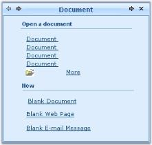
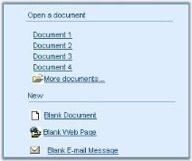

---
layout: post
title: XPTaskPanePage in Windows Forms XPTaskPane | Syncfusion®
description: XPTaskPanePage supports page titles, layout management, border customization, fonts, colors, and page-level appearance settings.
platform: windowsforms
control: XPTaskPane
documentation: ug
---

# XPTaskPanePage in Windows Forms XPTaskPane

XPTaskPane has a TaskPanePageContainer which hosts the Task pages. Any number of controls can be added to the Task pages and can be customized. Properties that control the appearance of the Task pages are discussed in this section.

>**NOTE**:
The `xpTaskPage1` instance used in the examples below is assumed to be created and added to the XPTaskPane as shown in the [Getting Started](https://help.syncfusion.com/windowsforms/xptaskpane/creating-a-simple-xptaskpane) documentation.

## Page title and layout name

The title text for an XPTaskPage can be edited using XPTaskPage.Title property.

**Property table**

<table>
<tr>
<th>
Property</th><th>
Description</th></tr>
<tr>
<td>
Title</td><td>
Sets the title text for the Task page.</td></tr>
<tr>
<td>
SelectedPage</td><td>
Specifies the selected Task page. This is a property of the XPTaskPane control.</td></tr>
<tr>
<td>
LayoutName</td><td>
The individual Task page is identified using its LayoutName in the SelectedPage property. By default the LayoutName is set as Card1, for the first page added, Card2 for the next page and so on. </td></tr>
</table>

The following code example shows how to select a page at run time using its `LayoutName`.





this.xpTaskPage1.Title = "XPTaskPane Header";

this.xpTaskPage1.LayoutName = "Card1";

//Select the page at run time.
this.xpTaskPane1.SelectedPage = this.xpTaskPage1;





Me.xpTaskPage1.Title = "XPTaskPane Header"

Me.xpTaskPage1.LayoutName = "Card1"

'Select the page at run time.
Me.xpTaskPane1.SelectedPage = Me.xpTaskPage1





 

## TaskPage border

The below properties control the border settings for a Task page.

**Property table**

<table>
<tr>
<th>
XPTaskPage property</th><th>
Description</th></tr>
<tr>
<td>
BorderStyle</td><td>
Specifies the border style for Task page. The available styles are Fixed3D and FixedSingle.</td></tr>
<tr>
<td>
Border3DStyle</td><td>
Specifies the 3D border style for Task page. The available styles are RaisedOuter, SunkenOuter, RaisedInner, Raised, Etched, SunkenInner, Bump, Sunken, Adjust, and Flat.</td></tr>
<tr>
<td>
BorderColor</td><td>
Sets the border color for the Task page.</td></tr>
<tr>
<td>
BorderSides</td><td>
Specifies the sides of the control which should have border.</td></tr>
<tr>
<td>
BorderSingle</td><td>
Specifies the 2D border style for the Task page when BorderStyle property is set to FixedSingle. The available styles are Dotted, Dashed, Solid, Inset, and Outset.</td></tr>
</table>





this.xpTaskPage1.BorderColor = System.Drawing.Color.SteelBlue;

this.xpTaskPage1.BorderStyle = System.Windows.Forms.BorderStyle.FixedSingle;





Me.xpTaskPage1.BorderColor = System.Drawing.Color.SteelBlue

Me.xpTaskPage1.BorderStyle = System.Windows.Forms.BorderStyle.FixedSingle





## XPTaskPage foreground

Font style and fore color of the Task pages can be set using XPTaskPage.Font and XPTaskPage.ForeColor properties.





this.xpTaskPage1.Font = new System.Drawing.Font("Arial", 8.25F);

this.xpTaskPage1.ForeColor = System.Drawing.Color.SteelBlue;





Me.xpTaskPage1.Font = New System.Drawing.Font("Arial", 8.25F)

Me.xpTaskPage1.ForeColor = System.Drawing.Color.SteelBlue





